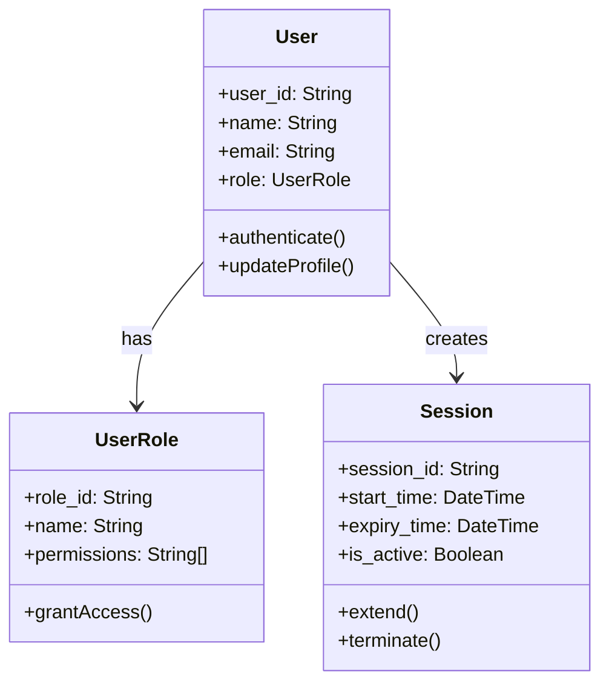
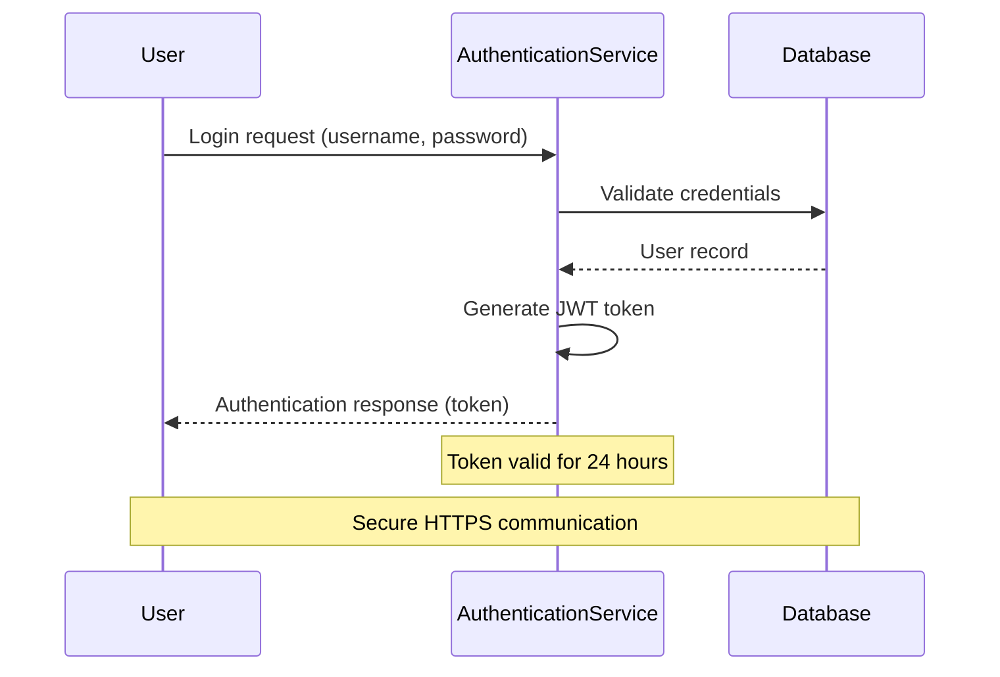
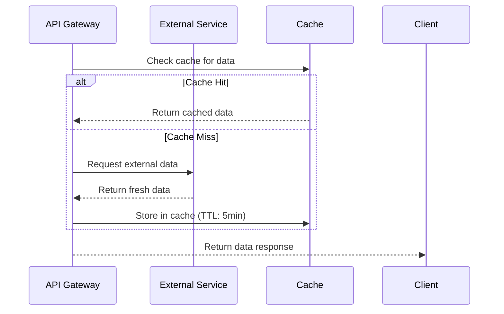

# Diagram Generate Collaboration

Generate visual collaboration diagrams from domain analysis to illustrate system interactions, user workflows, entity relationships, and domain models using Mermaid syntax embedded in markdown.

## Intent
Transform analyzed domain concepts and requirements into clear, actionable collaboration diagrams that visualize key system interactions, user journeys, cross-system workflows, and domain entity relationships. Focus on communicating complex relationships through standardized diagram patterns.

## Inputs
- **Primary**: `projects/[project-name]/artifacts/Analysis/domain-concepts.json` (from domain-extractconcepts skill)
- **Secondary**: `projects/[project-name]/artifacts/Analysis/requirements.json` (from requirements-ingest skill)
- **Tertiary**: `orgModel/**/domain-model.md` (existing domain models for class diagram generation)
- **Optional**: `projects/[project-name]/artifacts/Analysis/goals.json` (from goals-extract skill)
- **Format**: Structured domain entities, relationships, and requirements data

## Outputs
**Files Generated:**
- `projects/[project-name]/artifacts/Analysis/collaboration-diagrams.md` - Markdown with embedded Mermaid diagrams
- `projects/[project-name]/artifacts/Analysis/collaboration-diagrams.json` - Structured diagram metadata
- `orgModel/**/domain-model.md` - Updated organizational domain models with embedded class diagrams (when domain-model integration is requested)

### Markdown Structure (`collaboration-diagrams.md`)
```markdown
# Collaboration Diagrams

**Project**: [project_id]  
**Generated**: [timestamp]  
**Source**: domain-concepts.json, requirements.json

## Domain Class Model

### Entity Relationship Overview *(Diagram D-001)*
**Source Requirements**: [R-001], [R-003]  
**Domain Source**: orgModel/01-skill-dev/domain-model.md



## User-System Interactions

### Authentication Flow *(Diagram D-002)*
**Source Requirements**: [R-001], [R-003]  
**Entities Involved**: User, AuthenticationService, Database




### [Additional User-System Diagrams...]

## System-System Interactions

### API Integration Flow *(Diagram D-002)*
**Source Requirements**: [R-005], [R-007]  
**Entities Involved**: APIGateway, ExternalService, Cache



### [Additional System-System Diagrams...]

## Process Workflows

### [Business Process Diagrams...]
```

### JSON Structure (`collaboration-diagrams.json`)
```json
{
  "project_id": "string",
  "generation_metadata": {
    "generated_at": "ISO8601",
    "source_files": ["domain-concepts.json", "requirements.json"],
    "total_diagrams": "number",
    "diagram_types": ["class", "sequence", "flowchart", "stateDiagram"]
  },
  "diagrams": [
    {
      "id": "D-001",
      "title": "Entity Relationship Overview", 
      "type": "class",
      "category": "domain-model",
      "description": "Core domain entities and their relationships",
      "entities": ["User", "UserRole", "Session"],
      "source_requirements": ["R-001", "R-003"],
      "mermaid_code": "classDiagram...",
      "complexity": "medium",
      "maintenance_priority": "high"
    },
    {
      "id": "D-002",
      "title": "Authentication Flow", 
      "type": "sequence",
      "category": "user-system",
      "description": "User authentication and JWT token generation",
      "entities": ["User", "AuthenticationService", "Database"],
      "source_requirements": ["R-001", "R-003"],
      "mermaid_code": "sequenceDiagram...",
      "complexity": "medium",
      "maintenance_priority": "high"
    }
  ]
}
```

## Processing Workflow

### 1. Input Analysis
**From `domain-concepts.json`:**
- Extract entities with their relationships
- Identify domain areas and key processes
- Map entity interactions and dependencies

**From `requirements.json`:**
- Find interaction patterns in requirement text
- Identify user journeys and system flows
- Extract temporal sequences and decision points

### 2. Diagram Type Selection
**Domain Class Models:**
- Use class diagrams to visualize entity relationships and domain structure
- Include core entities with attributes and operations
- Show inheritance, composition, and association relationships
- Add styling to distinguish entity types (actors, core entities, enums)

**User-System Interactions:**
- Use sequence diagrams for user workflows
- Include system responses and error paths
- Show authentication, authorization flows

**System-System Interactions:**
- Use sequence diagrams for API communications
- Include timeouts, retries, and failure scenarios
- Show data flow between services

**Business Process Workflows:**
- Use flowcharts for decision trees and branching logic
- Include parallel processes and synchronization points
- Show approval workflows and state transitions

### 3. Mermaid Generation Rules

**Class Diagrams:**
```
classDiagram
    class [EntityName]:::[styleCategory] {
        +attribute_name: Type
        -private_attribute: Type
        +operation_name()
        -private_operation()
    }
    
    [SourceEntity] --> [TargetEntity] : relationship_label
    [ParentEntity] <|-- [ChildEntity]
    [CompositeEntity] *--> [ComponentEntity]
    [AggregateEntity] o--> [PartEntity]
```

**Naming Conventions for Class Diagrams:**
- Entity names: PascalCase (User, UserProfile, PaymentGateway)
- Attributes: snake_case (user_id, created_at, is_active)
- Methods: camelCase (authenticate(), updateProfile(), calculateTotal())
- Relationships: Use clear, descriptive labels
- Styling: Use inline styling with :::styleCategory syntax
- Style categories: actor, entity, enum, ai (or custom categories as needed)

**Sequence Diagrams:**
```
participant [ShortName] as [Full Entity Name]
[Actor]->>+[Target]: [Action description]
[Target]-->>-[Actor]: [Response description]
Note over [Entity]: [Important information]
alt [Condition]
    [Alternative flow]
else [Other condition]
    [Alternative flow]
end
```

**Naming Conventions:**
- Entity names: PascalCase (UserService, PaymentGateway)
- Messages: Action-oriented (Validate credentials, Process payment)
- Notes: Clarify business rules, timeouts, constraints
- Alt blocks: Show error handling and edge cases

### 4. Traceability Integration
**Requirement References:**
- Link each diagram to source requirements using `[R-XXX]` format
- Include entity references using `ENT-XXX` identifiers from domain concepts
- Maintain bidirectional traceability for change impact analysis
- Reference domain models using `orgModel/**/*domain-model.md` paths for class diagrams

**Diagram Metadata:**
- Assign unique diagram IDs (`D-001`, `D-002`, etc.)
- Track complexity level (simple/medium/complex)
- Set maintenance priority based on business criticality
- Category classification: domain-model, user-system, system-system, process-workflow

## Quality Guidelines

### Readability Standards
- **Class diagrams**: Limit to 10-15 entities maximum for clarity
- **Sequence diagrams**: Limit to 8-10 participants maximum  
- Use meaningful, business-friendly entity names
- Include essential attributes and methods only
- Include notes for non-obvious business rules
- Show both happy path and key error scenarios

### Technical Standards  
- Valid Mermaid syntax that renders in VS Code
- Consistent naming conventions across all diagram types
- Appropriate use of visibility markers (+/- for public/private)
- Clear distinction between inheritance, composition, and association
- Proper use of inline styling with :::category syntax for entity categorization
- Consistent participant naming across related diagrams
- Appropriate use of activation boxes for long-running operations
- Clear distinction between synchronous and asynchronous calls

### Business Value
- **Class diagrams**: Focus on core business entities and critical relationships
- **Interaction diagrams**: Focus on high-value interactions that need visualization
- Prioritize user-facing workflows and critical system integrations
- Include compliance and security-related flows
- Show cross-system dependencies that affect architecture decisions
- Ensure domain models align with organizational standards and terminology

## Usage Pattern
```
1. Call after domain-extractconcepts skill completion
2. Load domain-concepts.json and requirements.json  
3. Review existing orgModel domain models for class diagram context
4. Generate domain class diagrams showing entity relationships and structure
5. Generate collaboration diagrams for key interaction patterns
6. Output markdown file with embedded Mermaid diagrams and JSON metadata
7. Update project documentation with visual collaboration and domain models
8. For domain model integration: Update orgModel/**/domain-model.md with generated class diagrams
```

## Domain Model Integration Mode
When called with `domain_model_integration: true`, this skill:

1. **Extracts existing domain model structure** from `orgModel/**/domain-model.md`
2. **Generates enhanced class diagrams** based on textual domain descriptions
3. **Updates domain-model.md** by adding or replacing the "Domain Class Diagram" section
4. **Maintains consistency** with existing textual domain descriptions
5. **Preserves traceability** links to requirements and domain concepts

### Integration Input Parameters
```json
{
  "domain_model_integration": true,
  "target_domain_model": "orgModel/01-skill-dev/domain-model.md",
  "diagram_placement": "after_title|before_actors|replace_existing",
  "sync_with_text": true
}
```

## Integration Notes
- **Domain Model Sync**: Class diagrams complement and enhance textual domain models
- **Cross-Skill Integration**: Works with domain-extractconcepts, domain-alignentities, and orgmodel-update
- **Bidirectional Updates**: Can generate diagrams from text or update text from aligned concepts
- **Organizational Standards**: Domain class diagrams align with organizational domain model standards
- **Iterative Refinement**: Supports incremental updates as requirements and domain understanding evolve
- **VS Code Compatible**: All diagrams render properly in VS Code Mermaid preview

## Cross-Skill Workflow Integration

### With domain-extractconcepts:
- Consume `domain-concepts.json` as primary input
- Generate class diagrams from extracted entities and relationships
- Maintain entity IDs and traceability to source requirements

### With domain-alignentities:
- Use alignment results to update class diagrams with organizational standards
- Incorporate entity mappings and terminology standardization
- Reflect alignment recommendations in diagram structure

### With orgmodel-update:
- Coordinate domain-model.md updates to avoid conflicts
- Ensure diagram updates align with organizational model changes
- Support rollback capabilities for diagram modifications