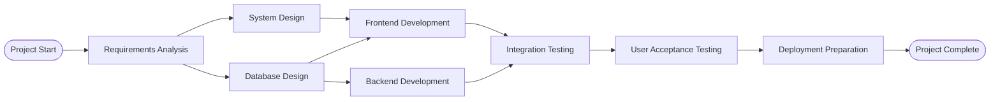

# Project Planning and Tracking

Provides structured approach to project planning, milestone tracking, and progress monitoring using templates that integrate with the established document tree structure.

## Core Function

**Input**: Project requirements, timeline constraints, resource information
**Output**: Project plans with PERT analysis, critical path identification, milestone tracking, progress reports, dynamic task management structures

## Planning Framework

### 1. Project Planning Workflow

```markdown
## Phase 1: Project Initiation
- [ ] Project charter creation
- [ ] Stakeholder identification  
- [ ] Initial requirements gathering
- [ ] Success criteria definition
- [ ] Resource assessment

## Phase 2: Planning
- [ ] Work breakdown structure (WBS)
- [ ] Timeline development
- [ ] Risk assessment
- [ ] Resource allocation
- [ ] Communication plan

## Phase 3: Execution & Monitoring
- [ ] Progress tracking
- [ ] Milestone reviews
- [ ] Risk mitigation
- [ ] Change management
- [ ] Quality assurance

## Phase 4: Closure
- [ ] Deliverable verification
- [ ] Lessons learned
- [ ] Documentation finalization
- [ ] Project closure report
```

### 2. PERT Analysis & Critical Path Management

#### PERT Diagram Template

Store as `project-plan.md` in project root:

```markdown
# [Project Name] - PERT Analysis

## Task Network Diagram



## Task Estimates (Three-Point Estimation)

| Task ID | Task Name | Optimistic (O) | Most Likely (M) | Pessimistic (P) | Expected Time (TE) | Variance (V) |
|---------|-----------|----------------|-----------------|-----------------|-------------------|--------------|
| T1 | Requirements Analysis | 5 days | 8 days | 15 days | 8.67 days | 2.78 |
| T2 | System Design | 3 days | 5 days | 10 days | 5.5 days | 1.36 |
| T3 | Database Design | 2 days | 4 days | 8 days | 4.33 days | 1.00 |
| T4 | Frontend Development | 8 days | 12 days | 20 days | 12.67 days | 4.00 |
| T5 | Backend Development | 10 days | 15 days | 25 days | 15.83 days | 6.25 |
| T6 | Integration Testing | 3 days | 5 days | 9 days | 5.33 days | 1.00 |
| T7 | User Acceptance Testing | 2 days | 4 days | 6 days | 4.0 days | 0.44 |
| T8 | Deployment Preparation | 1 day | 2 days | 4 days | 2.17 days | 0.25 |

### Formulas Used
- **Expected Time (TE)**: (O + 4M + P) / 6
- **Variance (V)**: ((P - O) / 6)²
- **Standard Deviation (σ)**: √V

## Critical Path Analysis

### Path Analysis
| Path | Tasks | Total Duration | Is Critical |
|------|-------|----------------|-------------|
| Path 1 | Start → T1 → T2 → T4 → T6 → T7 → T8 → End | 38.67 days | **YES** |
| Path 2 | Start → T1 → T3 → T4 → T6 → T7 → T8 → End | 37.17 days | No |
| Path 3 | Start → T1 → T3 → T5 → T6 → T7 → T8 → End | 40.33 days | **YES** |

### **Critical Path**: Start → T1 → T3 → T5 → T6 → T7 → T8 → End
- **Duration**: 40.33 days
- **Standard Deviation**: 3.24 days
- **99% Confidence Interval**: 40.33 ± 7.77 days (32.56 - 48.1 days)

## Critical Tasks (Zero Slack)
- T1: Requirements Analysis
- T3: Database Design  
- T5: Backend Development
- T6: Integration Testing
- T7: User Acceptance Testing
- T8: Deployment Preparation

## Forward and Backward Pass Calculations

### Forward Pass (Early Start/Early Finish Calculation)
**Purpose**: Determines the earliest possible start and finish times for each task.

**Rules**:
- Early Start (ES) = Maximum Early Finish of all predecessor tasks
- Early Finish (EF) = Early Start + Task Duration
- For the first task: ES = 0 (project start)

### Backward Pass (Late Start/Late Finish Calculation)  
**Purpose**: Determines the latest possible start and finish times without delaying the project.

**Rules**:
- Late Finish (LF) = Minimum Late Start of all successor tasks
- Late Start (LS) = Late Finish - Task Duration  
- For the last task: LF = EF (project must finish on time)

### Task Schedule Analysis Table

| Task | Duration | Predecessors | Successors | Early Start | Early Finish | Late Start | Late Finish | Total Slack | Free Slack | Critical |
|------|----------|-------------|------------|-------------|--------------|------------|-------------|-------------|------------|----------|
| T1   | 8.67     | Start       | T2, T3     | 0           | 8.67         | 0          | 8.67        | 0           | 0          | **Yes**  |
| T2   | 5.50     | T1          | T4         | 8.67        | 14.17        | 9.83       | 15.33       | 1.16        | 1.16       | No       |
| T3   | 4.33     | T1          | T4, T5     | 8.67        | 13.0         | 8.67       | 13.0        | 0           | 0          | **Yes**  |
| T4   | 12.67    | T2, T3      | T6         | 15.33       | 28.0         | 15.33      | 28.0        | 0           | 0          | **Yes**  |
| T5   | 15.83    | T3          | T6         | 13.0        | 28.83        | 13.0       | 28.83       | 0           | 0          | **Yes**  |
| T6   | 5.33     | T4, T5      | T7         | 28.83       | 34.16        | 28.83      | 34.16       | 0           | 0          | **Yes**  |
| T7   | 4.0      | T6          | T8         | 34.16       | 38.16        | 34.16      | 38.16       | 0           | 0          | **Yes**  |
| T8   | 2.17     | T7          | End        | 38.16       | 40.33        | 38.16      | 40.33       | 0           | 0          | **Yes**  |

### Slack Calculations
- **Total Slack**: LS - ES (or LF - EF) = Maximum delay without affecting project completion
- **Free Slack**: Minimum ES of successors - EF = Maximum delay without affecting successors
- **Critical Tasks**: Tasks with Total Slack = 0

## Risk Assessment
- **Schedule Risk**: High confidence (99%) project will complete within 48.1 days
- **Critical Path Sensitivity**: 5 tasks have zero slack - high sensitivity to delays
- **Resource Conflicts**: T4 and T5 can run in parallel (verify resource availability)
```

#### Dynamic PERT Update Template

Store as `pert-changes.md` in project planning folder:

```markdown
# PERT Adjustments Log - [Project Name]

## Progress Update Procedure

### Step 1: Update Task Progress
**Current Date**: [Status Date]

| Task | Planned Duration | Elapsed Time | % Complete | Actual Progress | Remaining Duration | Revised Duration |
|------|------------------|--------------|------------|-----------------|-------------------|------------------|
| T1   | 8.67 days       | 6 days       | 80%        | 6.93 days       | 1.74 days         | 8.67 days        |
| T2   | 5.50 days       | 0 days       | 0%         | 0 days          | 5.50 days         | 5.50 days        |

### Step 2: Forward Pass Recalculation
**Rules for Progress Updates**:
- **Completed Tasks**: ES = Actual Start Date, EF = Actual Finish Date
- **In-Progress Tasks**: ES = Actual Start Date, EF = Status Date + Remaining Duration
- **Future Tasks**: Recalculate ES based on new predecessor EF values

**Updated Forward Pass**:
| Task | Status | Actual/Revised ES | Actual/Revised EF | Variance |
|------|--------|-------------------|-------------------|----------|
| T1   | 80% Complete | 0 (actual) | 8.67 (forecast) | 0 days |
| T2   | Not Started | 8.67 | 14.17 | 0 days |
| T3   | Not Started | 8.67 | 13.0 | 0 days |

### Step 3: Backward Pass Recalculation
**Starting from project end date**: [Target Completion]

| Task | Revised LF | Revised LS | New Total Slack | New Critical Status |
|------|------------|------------|-----------------|-------------------|
| T1   | 8.67       | 0          | 0               | **Critical**      |
| T2   | 15.33      | 9.83       | 1.16            | Non-Critical      |

### Step 4: Schedule Impact Analysis
- **Project End Date Change**: [Original] → [New] ([+/- X days])
- **New Critical Path**: [Path with zero slack]
- **Slack Changes**: [Tasks that gained/lost slack]
- **Resource Reallocation Needed**: [Yes/No - details]

## Change Impact Analysis Template

### Change Request: [CR-ID] - [Description]
**Date**: [Date]
**Requested by**: [Stakeholder]
**Type**: [Add Task / Modify Duration / Change Dependencies / Remove Task]

#### Pre-Change Schedule Analysis
**Current Critical Path Duration**: [X days]
**Current Project End**: [Date]

#### Post-Change Forward Pass
Starting from project start, recalculate ES/EF for all affected tasks:

| Task | Previous Duration | New Duration | Previous ES | New ES | Previous EF | New EF | Change |
|------|------------------|--------------|-------------|--------|-------------|--------|---------|
| [Task] | X days | Y days | A | B | C | D | ±Z days |

#### Post-Change Backward Pass
Working backward from project target end date:

| Task | Previous LS | New LS | Previous LF | New LF | Slack Change | Critical Impact |
|------|-------------|--------|-------------|--------|--------------|----------------|
| [Task] | A | B | C | D | ±X days | [Yes/No] |

#### Impact Summary
- **Critical Path Duration**: [Previous] → [New] ([Change])
- **Project End Date Impact**: [±X days]
- **New Critical Tasks**: [List]
- **Tasks No Longer Critical**: [List]
- **Maximum Acceptable Delay Before Next Milestone**: [X days]

#### Mitigation Options
1. **Fast-Track Parallel Tasks**: [Specific opportunities]
2. **Crash Critical Path**: [Add resources to specific tasks]  
3. **Scope Reduction**: [Non-critical features to defer]
4. **Resource Reallocation**: [Move resources from non-critical to critical tasks]

### Updated Network Diagram
[Insert updated Mermaid diagram here]

### Updated Critical Path Calculation
**New Critical Path**: [Task sequence]
**Duration**: [X days]
**Probability of On-Time Completion**: [X%]
```

### 5. Progress Tracking with ES/EF/LS/LF Updates

#### Weekly Progress Update Template

Store as `weekly-pert-update.md`:

```markdown
# Weekly PERT Progress Update - [Project Name]
**Week Ending**: [Date]
**Status Cut-off**: [Day/Time]

## Task Progress Summary
| Task | Owner | Baseline Duration | Actual Start | Actual Progress | Forecast Finish | Baseline EF | Variance |
|------|-------|-------------------|--------------|-----------------|-----------------|-------------|----------|
| T1 | [Name] | 8.67 days | [Date] | 90% (7.8 days) | [Date] | [Date] | -0.87 days |
| T2 | [Name] | 5.50 days | [Date] | 40% (2.2 days) | [Date] | [Date] | +1.2 days |

## Schedule Recalculation Results

### Forward Pass Updates
**Completed this week**:
- T1: Finished 0.87 days early
- T3: Started on schedule

**Impact on future tasks**:
| Task | Previous ES | Updated ES | Previous EF | Updated EF | Schedule Impact |
|------|-------------|------------|-------------|------------|----------------|
| T2 | 8.67 | 7.8 | 14.17 | 13.3 | +0.87 days ahead |
| T4 | 15.33 | 14.46 | 28.0 | 27.13 | +0.87 days ahead |

### Backward Pass Updates
**Working from project target end**: [Target Date]

| Task | Previous LS | Updated LS | Previous LF | Updated LF | Slack Change |
|------|-------------|------------|-------------|------------|--------------|
| T2 | 9.83 | 8.96 | 15.33 | 14.46 | No change (1.16 days) |

### Critical Path Status
- **Current Critical Path**: T1 → T3 → T5 → T6 → T7 → T8
- **Duration**: 39.46 days (0.87 days ahead of baseline)
- **Project Forecast Completion**: [Date] ([X days ahead/behind target])

## Risk Assessment
### Schedule Risks
- **T2 Running Behind**: 1.2 days delay, but has 1.16 days slack - **Low Risk**
- **T5 Resource Availability**: Dependency on T3 completion - **Medium Risk**

### Opportunity Analysis
- **Early T1 Completion**: 0.87-day buffer created
- **Parallel Task Acceleration**: Can start T4 prep work early

## Actions Required
1. **Immediate**: Confirm T5 resource availability for next week
2. **This Week**: Begin T4 preliminary activities (design review prep)
3. **Next Week**: Re-baseline if T2 delay exceeds available slack

## Next Period Forecast
**Expected Completions**:
- T2: [Date] (1.2 days late, within slack)
- T3: [Date] (on schedule)

**Critical Dependencies**:
- T4 start depends on both T2 and T3 completion
- Resource allocation for T5 must be confirmed by [Date]
```

### 3. Milestone Template

Store as `project-milestones.md` in project root:

```markdown
# [Project Name] - Milestones

| ID | Milestone | Target Date | Status | Dependencies | Notes |
|----|-----------|-------------|---------|--------------|-------|
| M01 | Requirements Complete | YYYY-MM-DD | Not Started | - | Initial req gathering |
| M02 | Analysis Phase Done | YYYY-MM-DD | Not Started | M01 | Analysis artifacts |
| M03 | Design Approval | YYYY-MM-DD | Not Started | M02 | Stakeholder sign-off |
| M04 | Development Complete | YYYY-MM-DD | Not Started | M03 | All features implemented |
| M05 | Testing Complete | YYYY-MM-DD | Not Started | M04 | QA validation |
| M06 | Production Deployment | YYYY-MM-DD | Not Started | M05 | Go-live |

## Status Legend
- **Not Started**: Planning or waiting for dependencies
- **In Progress**: Active work ongoing
- **At Risk**: Behind schedule or blocked
- **Complete**: Milestone achieved
- **Cancelled**: No longer applicable
```

### 3. Task Tracking Template

Store as `project-tasks.md` in project root:

```markdown
# [Project Name] - Task Tracking

## Active Sprint/Iteration
**Period**: [Start Date] - [End Date]

### High Priority
- [ ] [Task Description] (Assigned: [Name], Due: [Date])
- [ ] [Task Description] (Assigned: [Name], Due: [Date])

### Medium Priority  
- [ ] [Task Description] (Assigned: [Name], Due: [Date])
- [ ] [Task Description] (Assigned: [Name], Due: [Date])

### Low Priority
- [ ] [Task Description] (Assigned: [Name], Due: [Date])
- [ ] [Task Description] (Assigned: [Name], Due: [Date])

## Completed Tasks
- [x] [Completed Task] (Completed: [Date])

## Blocked/Waiting
- [ ] [Blocked Task] - Blocked by: [Reason/Dependency]

## Next Sprint Candidates
- [ ] [Future Task] (Estimated Effort: [Size])
```

### 4. Dynamic PERT-Based Task Management

#### Real-Time Critical Path Monitoring

Store as `critical-path-monitor.md`:

```markdown
# Critical Path Monitoring - [Project Name]

## Current Schedule Status
**Last Updated**: [Date/Time]
**Status Date**: [Current project date]
**Critical Path Duration**: [X days]
**Project Health**: [🟢 On Track | 🟡 At Risk | 🔴 Behind]
**Baseline End Date**: [Date]
**Forecast End Date**: [Date]
**Schedule Variance**: [±X days]

### Real-Time Schedule Calculations

#### Forward Pass Status (Early Dates)
| Task | Status | Actual/Forecast ES | Actual/Forecast EF | Baseline EF | EF Variance |
|------|--------|-------------------|-------------------|-------------|-------------|
| T1 | Complete | [Date] (actual) | [Date] (actual) | [Date] | [±X days] |
| T2 | 60% Complete | [Date] (actual) | [Date] (forecast) | [Date] | [±X days] |
| T3 | Not Started | [Date] (forecast) | [Date] (forecast) | [Date] | [±X days] |

#### Backward Pass Status (Late Dates)
| Task | Current LS | Current LF | Baseline LS | Baseline LF | Allowable Delay |
|------|------------|------------|-------------|-------------|-----------------|
| T1 | [Date] | [Date] | [Date] | [Date] | [X days] |
| T2 | [Date] | [Date] | [Date] | [Date] | [X days] |
| T3 | [Date] | [Date] | [Date] | [Date] | [X days] |

### Current Critical Path Analysis
**Active Critical Path**: [Task sequence with zero slack]
**Near-Critical Paths (≤2 days slack)**:
- Path 2: [Task sequence] - [X days slack]
- Path 3: [Task sequence] - [Y days slack]

### Critical Tasks Status Detail
| Task ID | Task Name | Original Duration | Actual/Remaining | ES Status | EF Status | Slack Status | Risk Level |
|---------|-----------|-------------------|------------------|-----------|-----------|--------------|------------|
| T1 | [Task] | X days | Y days remaining | [On/Late] | [On/Late] | 0 days | [🟢🟡🔴] |

### Schedule Pressure Analysis
**Tasks Under Pressure** (ES > planned ES):
- [Task]: [X days behind] expected start
- [Task]: [Y days behind] expected start

**Schedule Buffers Available**:
- Non-critical task slack: [Sum of available slack]
- Management reserve: [X days]
- Resource acceleration potential: [Y days]

### Early Warning Indicators
| Indicator | Current Value | Threshold | Status | Trend |
|-----------|---------------|-----------|---------|-------|
| Critical Path Delay | [±X days] | ±2 days | [🟢🟡🔴] | [↗↗↘] |
| Slack Consumption Rate | [X%] | >80% | [🟢🟡🔴] | [↗↗↘] |
| Task Start Variance | [±Y days] | ±1 day | [🟢🟡🔴] | [↗↗↘] |
| Resource Overallocation | [Z%] | >100% | [🟢🟡🔴] | [↗↗↘] |

## Schedule Recovery Options

### Fast-Tracking Opportunities
**Current Sequential Tasks That Could Be Parallel**:
| Current Sequence | Fast-Track Option | Risk | Time Savings |
|-----------------|-------------------|------|--------------|
| T2 → T4 | Start T4 at 80% T2 complete | Medium | 1.1 days |
| T6 → T7 | Overlap testing phases | Low | 1.5 days |

### Crashing Options (Add Resources)
**Tasks Where Resources Can Accelerate Work**:
| Task | Current Resources | Additional Resources Available | Potential Time Reduction | Cost Impact |
|------|-------------------|------------------------------|--------------------------|-------------|
| T5 | 2 developers | +1 senior dev | 3.2 days | $X cost |
| T6 | 1 tester | +1 tester | 1.8 days | $Y cost |

### Scope Reduction Opportunities
**Non-Critical Features That Could Be Deferred**:
| Feature | Associated Tasks | Schedule Impact | Business Impact |
|---------|------------------|-----------------|----------------|
| [Feature] | T4.1, T4.3 | -2.1 days | Low |
| [Feature] | T7.2 | -1.5 days | Medium |
```

#### Schedule Compression Decision Framework

```markdown
# Schedule Compression Analysis

## Current Situation Assessment
**Schedule Pressure**: [High/Medium/Low]
**Available Compression Time Needed**: [X days]
**Budget Availability**: [High/Medium/Low]
**Quality Requirements**: [Flexible/Fixed]

## Compression Options Matrix

| Option | Time Saved | Cost | Risk | Quality Impact | Effort |
|--------|-------------|------|------|----------------|--------|
| Fast-track T2→T4 | 1.1 days | Low | Med | Low | Low |
| Crash T5 (+resource) | 3.2 days | High | Low | None | Med |
| Scope reduction | 2.1 days | None | None | Med | Low |
| Weekend work | 1.5 days | Med | Low | Low | High |

## ES/EF/LS/LF Impact Analysis

### Fast-Tracking Impact
**Before Fast-Track**:
- T2: ES=8.67, EF=14.17, LS=9.83, LF=15.33
- T4: ES=15.33, EF=28.0, LS=15.33, LF=28.0

**After Fast-Track** (start T4 when T2 is 80% complete):
- T2: ES=8.67, EF=14.17, LS=9.83, LF=15.33 (unchanged)
- T4: ES=13.07 (early start), EF=25.74, LS=15.33, LF=28.0
- **Schedule Compression**: 2.26 days on T4 path

### Crashing Impact
**T5 with Additional Resource**:
- Original Duration: 15.83 days
- With +1 resource: 12.63 days (3.2 days saved)
- **Critical Path Impact**: ES=13.0, EF=25.63 (vs 28.83)
- **Project Completion**: 3.2 days earlier

## Recommended Strategy
Based on ES/EF/LS/LF analysis:
1. **Primary**: Fast-track T2→T4 (1.1 days, low cost/risk)
2. **Secondary**: Crash T5 if budget allows (3.2 days, higher cost)
3. **Fallback**: Scope reduction (2.1 days, no cost)
```

#### PERT-Based Estimation Refinement

```markdown
# Estimation Refinement Process

## Three-Point Estimation Guidelines

### Historical Calibration
Track estimation accuracy to improve future estimates:

| Task Type | Estimation Accuracy | Adjustment Factor |
|-----------|-------------------|-------------------|
| Requirements Analysis | 85% | 1.15x |
| Design Tasks | 90% | 1.10x |
| Development | 75% | 1.30x |
| Testing | 95% | 1.05x |

### Dynamic Re-estimation Triggers
- **Scope Change**: Recalculate affected tasks and dependencies
- **Resource Change**: Update durations based on team capacity  
- **Risk Materialization**: Apply contingency time to affected paths
- **Learning Curve**: Adjust estimates as team gains domain knowledge

### Estimation Update Process
1. **Identify Trigger**: [Scope/Resource/Risk/Learning change]
2. **Assess Impact**: Determine which tasks are affected
3. **Re-estimate Tasks**: Apply three-point estimation to changed tasks
4. **Recalculate Network**: Update PERT diagram and critical path
5. **Communicate Changes**: Update stakeholders on schedule impact
6. **Update Tracking**: Modify milestone dates and resource plans
```

#### Change Management Integration

```markdown
# PERT-Integrated Change Management

## Change Assessment Workflow

### Step 1: Change Classification
- **Type A - Minor**: No critical path impact, <5% schedule change
- **Type B - Moderate**: Potential critical path impact, 5-15% schedule change  
- **Type C - Major**: Definite critical path impact, >15% schedule change

### Step 2: PERT Impact Analysis
For each change request:

1. **Map to Network**: Identify affected tasks in PERT diagram
2. **Estimate New Durations**: Use three-point estimation for changed tasks
3. **Update Dependencies**: Modify task relationships as needed
4. **Recalculate Paths**: Determine new critical path and duration
5. **Assess Resources**: Check for resource conflicts or needs

### Step 3: Decision Matrix
| Change Impact | Business Value | Recommendation |
|---------------|----------------|----------------|
| Low + High Value | High | Approve |
| Low + Medium Value | Medium | Approve conditionally |
| Low + Low Value | Low | Defer/Reject |
| High + High Value | High | Approve with mitigation |
| High + Medium Value | Medium | Requires sponsor approval |
| High + Low Value | Low | Reject |

### Step 4: Implementation Planning
- **Timeline Adjustment**: Update project schedule
- **Resource Reallocation**: Shift resources to maintain critical path
- **Risk Mitigation**: Address new risks introduced by change
- **Stakeholder Communication**: Notify affected parties
```

## Progress Tracking

### Weekly Status Report Template

```markdown
# Weekly Status Report - [Project Name]
**Week of**: [Date Range]
**Prepared by**: [Name]
**Next Update**: [Date]

## Executive Summary
[High-level status - Green/Yellow/Red with brief explanation]

## Progress This Week
### Completed
- [Accomplishment 1]
- [Accomplishment 2]

### In Progress
- [Current Work Item 1] - [% Complete]
- [Current Work Item 2] - [% Complete]

## Upcoming (Next Week)
- [Planned Task 1]
- [Planned Task 2]

## Issues & Risks
| Issue | Impact | Mitigation | Owner | Target Resolution |
|-------|--------|------------|-------|-------------------|
| [Issue] | [High/Med/Low] | [Action] | [Person] | [Date] |

## Milestone Status
- **Next Milestone**: [Name] - [Target Date] - [On Track/At Risk/Behind]
- **Key Dependency**: [What needs to happen]

## Resource Status
- **Team Availability**: [Any capacity issues]
- **Budget Utilization**: [% used / remaining]
- **Critical Needs**: [Resources needed]

## Metrics
- **Requirements**: [# Complete] / [# Total] ([% Complete])
- **Test Cases**: [# Passed] / [# Total] ([% Coverage])
- **Key Deliverables**: [# Complete] / [# Planned]
```

### Project Health Dashboard

Store as `project-health.md`:

```markdown
# [Project Name] - Health Dashboard

## Overall Health: [🟢 Green | 🟡 Yellow | 🔴 Red]

### Key Performance Indicators

| Metric | Current | Target | Status | Trend |
|--------|---------|---------|---------|-------|
| Schedule Adherence | [%] | 90% | [🟢🟡🔴] | [↗↗↘] |
| Budget Utilization | [%] | <80% | [🟢🟡🔴] | [↗↗↘] |
| Requirements Completeness | [%] | 100% | [🟢🟡🔴] | [↗↗↘] |
| Defect Rate | [#] | <5 | [🟢🟡🔴] | [↗↗↘] |
| Stakeholder Satisfaction | [rating] | >4/5 | [🟢🟡🔴] | [↗↗↘] |

### Risk Register
| Risk | Probability | Impact | Mitigation | Owner | Status |
|------|-------------|---------|-------------|-------|---------|
| [Risk Description] | [H/M/L] | [H/M/L] | [Action] | [Name] | [Active/Resolved] |

### Change Log
| Date | Change | Impact | Approved By |
|------|--------|---------|-------------|
| [Date] | [Description] | [Schedule/Budget/Scope] | [Stakeholder] |
```

## Integration with Document Tree

### Project Structure Enhancement

Adds planning artifacts to existing project structure:

```
orgDocument/projects/[NN] - [project name]/
├── requirements/
├── artifacts/
├── main.md
├── project-milestones.md      # Milestone tracking
├── project-tasks.md           # Task management  
├── project-health.md          # Health dashboard
├── project-pert.md            # PERT analysis and critical path
├── status-reports/            # Weekly/monthly reports
│   ├── YYYY-MM-DD-weekly.md
│   └── YYYY-MM-DD-monthly.md
└── planning/                  # Planning artifacts  
    ├── project-charter.md
    ├── work-breakdown.md
    ├── risk-register.md
    ├── resource-plan.md
    ├── pert-changes.md        # PERT change log
    ├── critical-path-monitor.md # Real-time critical path status
    └── weekly-pert-update.md  # Weekly ES/EF/LS/LF progress tracking
```

## Quick Commands

### Initialize Project Planning
1. Create planning folder structure
2. Generate milestone template
3. Create task tracking template  
4. Initialize health dashboard
5. **Create PERT analysis framework**
6. **Set up critical path monitoring**
7. Set up status reporting schedule

### Initialize PERT Analysis
**Parameters**: task_list, dependencies, duration_estimates
**Actions**:
1. Create PERT network diagram (Mermaid format)
2. Calculate three-point estimates for each task
3. Identify critical path and task slack
4. Generate dependency matrix
5. Set up change impact tracking
6. Initialize real-time monitoring

### Update Project Status
1. **Collect Progress Data**: Task completion percentages, actual durations
2. **Perform Forward Pass**: Recalculate ES/EF from project start using actual data
3. **Perform Backward Pass**: Recalculate LS/LF from project target end date  
4. **Update Slack Calculations**: Identify new critical path and slack changes
5. **Assess Schedule Impact**: Compare forecast vs baseline completion dates
6. **Generate Variance Report**: Document early/late indicators
7. Update health metrics

### Process Change Request
**Parameters**: change_description, affected_tasks, new_requirements
**Actions**:
1. **Pre-Change Analysis**: Document current ES/EF/LS/LF values
2. **Model Change Impact**: Update task durations and dependencies  
3. **Forward Pass Recalculation**: Compute new ES/EF values
4. **Backward Pass Recalculation**: Compute new LS/LF values
5. **Critical Path Analysis**: Identify new critical path and slack changes
6. **Schedule Impact Assessment**: Quantify project completion date impact
7. **Resource and Cost Analysis**: Evaluate additional resource needs
8. Recommend approval/rejection with quantified impacts
9. Update project documentation if approved

### Weekly Progress Update Workflow
**Frequency**: Every week on [Day]
**Actions**:
1. **Collect Actuals**: Gather actual start/finish dates and progress percentages
2. **Update Task Status**: Mark completed tasks and remaining durations
3. **Forward Pass Update**: Recalculate ES/EF using actual data and revised estimates
4. **Backward Pass Update**: Verify LS/LF based on project target dates
5. **Slack Monitoring**: Track slack consumption and critical path changes
6. **Variance Analysis**: Compare actual vs planned ES/EF dates
7. **Risk Assessment**: Flag tasks approaching or exceeding LF dates
8. **Generate Progress Report**: Document schedule status and forecast
9. **Stakeholder Communication**: Highlight critical changes requiring attention

### Critical Path Optimization
**Actions**:
1. Identify tasks with longest durations on critical path
2. Analyze opportunities for task parallelization
3. Consider resource reallocation options
4. Evaluate fast-tracking possibilities
5. Assess crashing options (adding resources)
6. Update PERT network with optimizations

### Milestone Review
1. Evaluate milestone criteria completion
2. Update milestone status
3. Identify next period priorities
4. Document lessons learned
5. Plan celebration/communication

## Planning Best Practices

1. **Regular Updates**: Weekly task updates, bi-weekly milestone reviews
2. **Clear Ownership**: Assign specific owners to tasks and milestones
3. **Realistic Estimates**: Use historical data and three-point estimation with buffer time
4. **Early Warning**: Flag risks and issues promptly, monitor slack consumption
5. **Stakeholder Communication**: Regular, consistent status updates
6. **Continuous Improvement**: Capture and apply lessons learned
7. **PERT Discipline**: Update network diagram with any scope or dependency changes
8. **Critical Path Focus**: Prioritize resources and risk mitigation on critical path tasks
9. **Dynamic Replanning**: Reassess estimates and paths when actual progress varies significantly
10. **Slack Management**: Use non-critical task slack strategically for risk buffering

## PERT-Specific Best Practices
### Calculation Procedures
**Forward Pass (ES/EF Calculation)**:
1. Start with first task: ES = 0 (or project start date)
2. For each task: EF = ES + Duration  
3. For successor tasks: ES = Maximum EF of all predecessors
4. Continue until all tasks calculated
5. Project duration = Maximum EF of final tasks

**Backward Pass (LS/LF Calculation)**:
1. Start with last task: LF = EF (project target end date)
2. For each task: LS = LF - Duration
3. For predecessor tasks: LF = Minimum LS of all successors  
4. Continue backward until all tasks calculated
5. Verify: LS of first task should equal ES (for critical path)

**Progress Update Calculations**:
1. **Completed Tasks**: Use actual start/finish dates for ES/EF
2. **In-Progress Tasks**: ES = actual start, EF = status date + remaining duration
3. **Future Tasks**: Recalculate based on predecessor actual/forecast finish dates
4. **Time-Now Line**: Draw vertical line on network at current date
### Estimation Quality
- **Use Historical Data**: Calibrate estimates based on past project performance
- **Expert Judgment**: Involve technical experts in three-point estimation
- **Regular Refinement**: Update estimates as more information becomes available
- **Conservative Optimism**: Ensure optimistic estimates are truly achievable

### Network Maintenance
- **Version Control**: Track PERT diagram changes with timestamps and reasons
- **Dependency Validation**: Regularly verify task dependencies are still accurate
- **Path Analysis**: Recalculate critical path weekly or after any major change
- **Scenario Planning**: Maintain alternative network configurations for major risks

### Change Management
- **Impact Assessment**: Always quantify change impact on critical path
- **Stakeholder Approval**: Require sponsor approval for changes affecting critical path by >10%
- **Documentation**: Maintain clear audit trail of all PERT modifications
- **Communication**: Immediately notify team of critical path changes

## Metrics and KPIs

### Schedule Metrics
- Milestone completion rate
- Task completion velocity  
- Schedule variance percentage
- Critical path adherence
- **Critical path duration variance**
- **Slack consumption rate**
- **Estimation accuracy by task type**
- **Critical path change frequency**

### PERT-Specific Metrics
- **Schedule Performance Index (SPI)**: Earned Value / Planned Value
- **Critical Path Buffer**: Available slack on near-critical paths
- **Network Density**: Number of dependencies / Number of tasks
- **Path Convergence Risk**: Number of tasks feeding into critical convergence points
- **Estimation Confidence**: Standard deviation of project completion time
- **Change Impact Frequency**: % of changes affecting critical path

### Quality Metrics
- Requirements traceability
- Test case pass rate
- Defect discovery rate
- Stakeholder satisfaction scores
- **Task dependency accuracy**
- **Estimation error trends**

### Resource Metrics
- Budget utilization
- Team capacity utilization
- Resource allocation efficiency
- Change request impact

## Reporting Cadence

- **Daily**: Task updates (via comments/status), critical path task monitoring
- **Weekly**: Status reports and team meetings, **ES/EF/LS/LF progress updates**, critical path recalculation
- **Bi-weekly**: Milestone reviews and planning, PERT network validation  
- **Monthly**: Health dashboard updates and stakeholder reports, estimation accuracy review
- **Quarterly**: Project retrospectives and process improvements, PERT methodology refinement
- **Ad-hoc**: Change request impact assessment, critical path optimization sessions

## ES/EF/LS/LF Quick Reference

### Calculation Formulas
```
Forward Pass (ES/EF):
- ES(task) = MAX(EF of all predecessors), with ES(first task) = 0
- EF(task) = ES(task) + Duration(task)

Backward Pass (LS/LF):  
- LF(task) = MIN(LS of all successors), with LF(last task) = EF(last task)
- LS(task) = LF(task) - Duration(task)

Slack Calculations:
- Total Slack = LS - ES = LF - EF
- Free Slack = MIN(ES of successors) - EF
- Critical Path = All tasks where Total Slack = 0
```

### Example Calculation Walkthrough
**Sample Network**: A(3) → B(5) → D(4) and A(3) → C(7) → D(4)

**Forward Pass**:
- A: ES=0, EF=0+3=3
- B: ES=3, EF=3+5=8
- C: ES=3, EF=3+7=10  
- D: ES=MAX(8,10)=10, EF=10+4=14

**Backward Pass** (Target end=14):
- D: LF=14, LS=14-4=10
- B: LF=10, LS=10-5=5
- C: LF=10, LS=10-7=3
- A: LF=MIN(5,3)=3, LS=3-3=0

**Slack Analysis**:
- A: Slack = 3-0 = 3 days (Non-critical)
- B: Slack = 5-3 = 2 days (Non-critical)  
- C: Slack = 3-3 = 0 days (**Critical**)
- D: Slack = 10-10 = 0 days (**Critical**)

**Critical Path**: A → C → D (11 days total)

### Progress Update Example
**Status Date**: Day 5
**Progress**: A completed in 2 days, C is 40% complete (2.8 days done, 4.2 days remaining)

**Updated Forward Pass**:
- A: ES=0 (actual), EF=2 (actual)
- C: ES=2 (actual), EF=2+4.2=6.2 (forecast)
- D: ES=6.2 (forecast), EF=6.2+4=10.2 (forecast)

**Schedule Impact**: Project now forecast to complete on Day 10.2 instead of Day 14 (3.8 days ahead)

---

## GitHub-Integrated Task Management

### Modern Task Management Approach

For projects requiring team collaboration and external feedback, implement task management using GitHub Issues format that enables seamless integration with GitHub's issue tracking system:

#### Task Management Structure
```
projects/[NN] - [Project Name]/
├── tasks/                    # Individual task files in GitHub issue format
│   ├── T##-task-name.md     # Task files aligned with project plan numbering  
│   ├── task-tracking.md # Overall task progress tracking
│   └── README.md            # Task management workflow documentation
└── project-plan.md      # Main project plan with PERT analysis
```

#### Task File Template (GitHub Issue Format)
```markdown
# Issue: T## - [Task Name]
**State:** [open|ready|in-progress|review|closed]  
**Labels:** [feature,core-skill,phase1]  
**Assignees:** [team member]  
**Milestone:** [Phase X - Phase Name]  
**Priority:** [High|Medium|Low]
**Issue Number:** #T##
**Estimated Effort:** [X.X days] (from PERT analysis)

## Description
[Clear description aligned with project plan WBS]

## Acceptance Criteria
- [ ] [Specific measurable outcome]
- [ ] [Technical requirement]
- [ ] [Documentation requirement]

## Tasks
- [ ] [Detailed implementation sub-task]
- [ ] [Testing sub-task]
- [ ] [Documentation sub-task]

## Dependencies
- T##: [Prerequisite task name from critical path]

## Comments
<!-- Team feedback and discussion appear here when exported from GitHub -->
```

#### Task Tracking Dashboard (task-tracking.md)
Provides real-time view of project progress aligned with PERT analysis:

```markdown
# [Project Name] - Task Tracking

**Current Phase**: [Phase X - Phase Name]  
**Project Focus**: [Brief description from project charter]

## Phase 1: [Phase Name] (Current Status)

### Completed ✅
- [x] **T1 - [Task Name]** ([Completion Date])
- [x] **T2 - [Task Name]** ([Completion Date])

### In Progress 🔄
- [ ] **T3 - [Current Task]** 
  - **Owner**: [Team Member]
  - **Due**: [Date from PERT schedule]
  - **Effort**: [X.X days] (from PERT estimate)
  - **Dependencies**: [Critical path dependencies]

### Ready to Start 📋
- [ ] **T4 - [Next Task]**
  - **Effort**: [X.X days] (PERT estimate)
  - **Dependencies**: T3 completion

## Progress Metrics
**Phase Progress**: [X]/[Total] tasks complete ([%])  
**Overall Project Progress**: [X]/[Total] tasks complete ([%])  
**Critical Path Status**: [On track/Behind/Ahead]
**Estimated Completion**: [Date] ([On track/X days behind/ahead])

## GitHub Integration Benefits
1. **Team Collaboration**: Distributed teams can provide feedback via GitHub comments
2. **Issue Tracking**: Full GitHub Issues functionality (labels, milestones, assignments)  
3. **Traceability**: Maintain links between tasks, requirements, and project plan
4. **Version Control**: Task evolution tracked through GitHub history
5. **Automation**: GitHub Actions can automate progress reporting and notifications
```

This approach combines traditional project management rigor (PERT analysis, critical path) with modern collaborative development practices (GitHub Issues, distributed feedback).