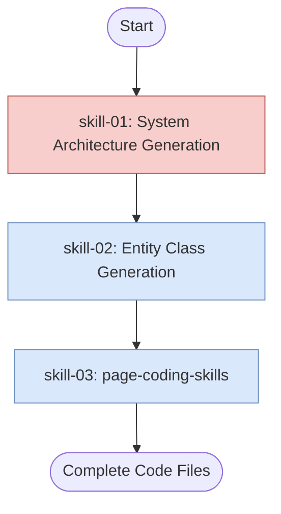

## Overview

Top-level orchestrator skill that drives full Blazor project code generation from a domain model. It sequentially invokes system-architecture-generation and entity-class-generation, then delegates page generation to the `page-generation` subprocess.

## Actor

Senior .NET Architect - responsible for overseeing the entire code generation process, ensuring that each skill is executed in the correct sequence, and that the final output meets architectural and coding standards.

## Type

Orchestrator - coordinates multiple skills and subprocesses to achieve the overall goal of generating a complete Blazor project.

## Flow

## Steps

1. Read inputs: `domain-model.json`
2. Invoke **system-architecture-generation** → generates solution file and project folder structure
3. Invoke **entity-class-generation** → generates `Entities/*.cs` from system-architecture-generation output
4. Invoke **page-generation** subprocess → generates repositories, page components, form pages, and list pages
5. Return all generated code files

> For inputs and outputs, see [structure.json](structure.json).
