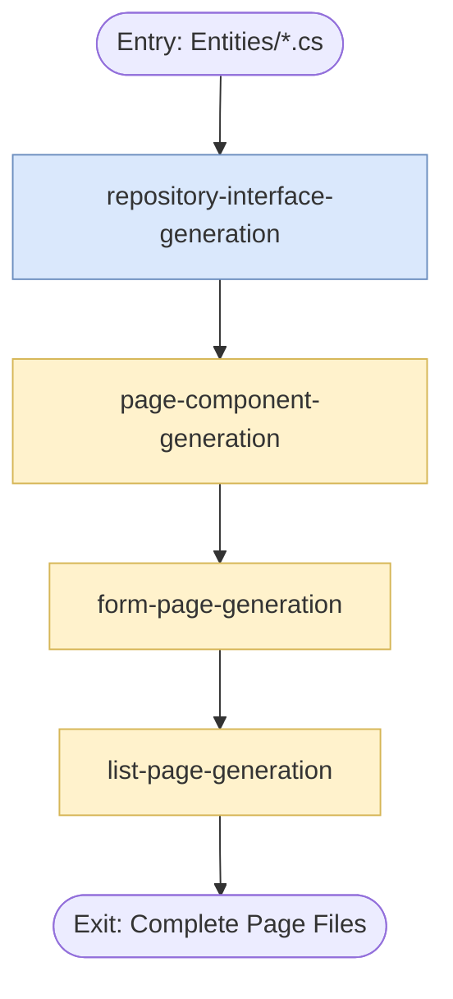

## Subprocess: page-generation

This subprocess covers repository interface generation through all page component generation.
It is invoked after entity-class-generation produces the entity classes.



---

## Skill Base Structure (Required for Each Skill)

Each Skill contains the following two files:

### 1. SKILL.md
The skill description file, explaining the skill's purpose, usage, and execution steps.

### 2. structure.json
The skill file structure definition, with the following format:

```json
{
	"name": "",
	"description": "",
	"type": "",
	"actor": "",
	"ins": [],
	"outs": []
}
```

| Field       | Description                     |
| ----------- | ------------------------------- |
| name        | Skill name                      |
| description | Skill functional description    |
| type        | Skill type: Orchestrator / Task |
| actor       | Executor                        |
| ins         | List of input files             |
| outs        | List of output files            |

---

## Subprocess Skills Summary

| Name                            | Input Source                           | Main Outputs                            |
| ------------------------------- | -------------------------------------- | --------------------------------------- |
| repository-interface-generation | entity-class-generation output         | Repositories/I*.cs                      |
| page-component-generation       | repository-interface-generation output | Layout, navigation, and base components |
| form-page-generation            | page-component-generation output       | Create/Edit/Details/Delete pages        |
| list-page-generation            | form-page-generation output            | Index list page                         |
