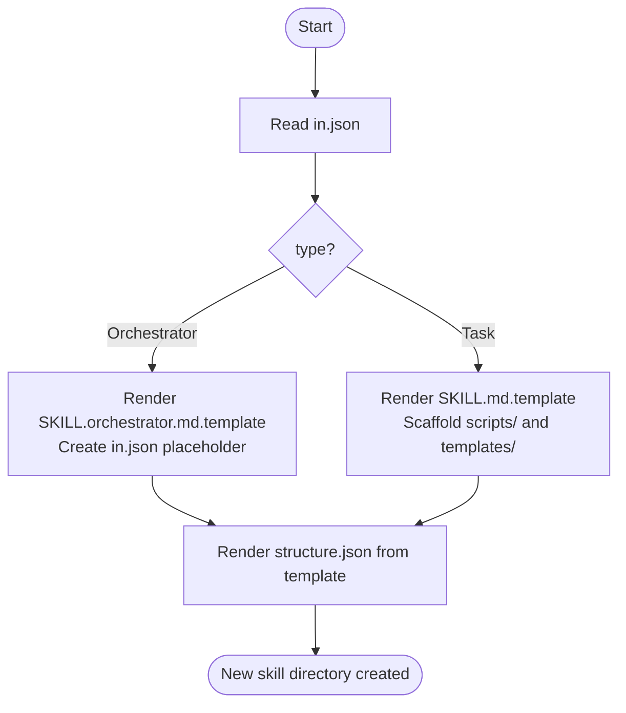

## Overview

Scaffolds a new skill under `.github/skills/` following the standard sanjel-coding-skills structure. Given a skill definition in `in.json`, it generates all required files based on the skill's **type**: `Orchestrator` or `Task`.

## Actor

Skill Architect

## Type

Task

## Skill Types

All skills belong to one of two categories:

| Type | Role | Key Characteristics |
|---|---|---|
| **Orchestrator** | Coordinates multiple sub-skills by invoking them in sequence according to a flow | Flow diagram shows sub-skill invocations; minimal or no script logic; ships with `in.json` and optional `media.json` |
| **Task** | Executes a specific, self-contained unit of work | Detailed Steps section; uses `scripts/` and `templates/` directories for implementation |

## Flow

## Steps

1. Read `in.json` for the new skill's `name`, `description`, `type`, `actor`, `ins`, and `outs`
2. Based on `type`:
   - **Orchestrator**: render `SKILL.md` from `templates/SKILL.orchestrator.md.template`; create an empty `in.json` placeholder
   - **Task**: render `SKILL.md` from `templates/SKILL.md.template`; scaffold empty `scripts/` and `templates/` directories
3. Render `structure.json` from `templates/structure.json.template` for both types

> For inputs and outputs, see [structure.json](structure.json).
