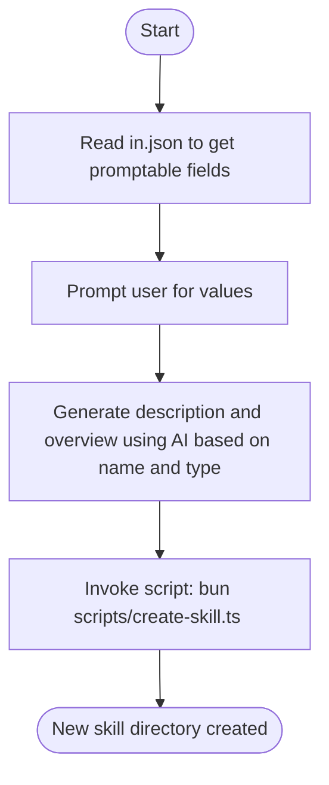

## Overview

Scaffolds a new skill under `.github/skills/` following the standard sanjel-coding-skills structure. Prompts the user for required values, uses AI to generate descriptions, then invokes a script to create all required files based on the selected **type**: `Orchestrator` or `Task`.

## Actor

Skill Architect

## Type

Task

## Skill Types

All skills belong to one of two categories:

| Type | Role | Key Characteristics | Required Files/Directories |
|---|---|---|---|
| **Orchestrator** | Orchestrator - coordinates multiple sub-skills by invoking them in sequence | Flow diagram shows sub-skill invocations; minimal or no script logic; ships with `SKILL.md`, `structure.json`, `in.json` (placeholder) and optional `media.json` | `SKILL.md`, `structure.json`, `in.json`, `media.json` (optional) |
| **Task** | Task - executes a specific, self-contained unit of work | Detailed Steps section; requires `scripts/*.ts` if non-AI driven; typically includes `templates/*` for code generation | `SKILL.md`, `structure.json`, `templates/*`, `scripts/*.ts` (if non-AI driven), `in.json` (optional) |

## Flow



## Steps

1. Read `in.json` to get promptable field definitions
2. Prompt user for values based on the field definitions
3. Use AI to generate `description` and `overview` based on `name` and `type`
4. Invoke script with all parameters: `bun scripts/create-skill.ts <name> <type> <actor> <AIDriven> <description> <overview> <ins> <outs>`
5. Script creates the skill directory and files based on type and AIDriven flag

## File Structure

### Standard Skill Directory Layout
```
skill-name/
├── SKILL.md           # Skill definition with overview, actor, type, flow, and steps
├── structure.json     # Defines inputs (ins), outputs (outs), and optional media reference
├── media.json         # (Optional) Media assets referenced in the skill
├── in.json            # (Optional) Input data for skill execution; required for Orchestrator
├── scripts/           # (Task type, optional) TypeScript scripts for non-AI driven execution
└── templates/         # (Task type, optional) Template files for code generation
```
