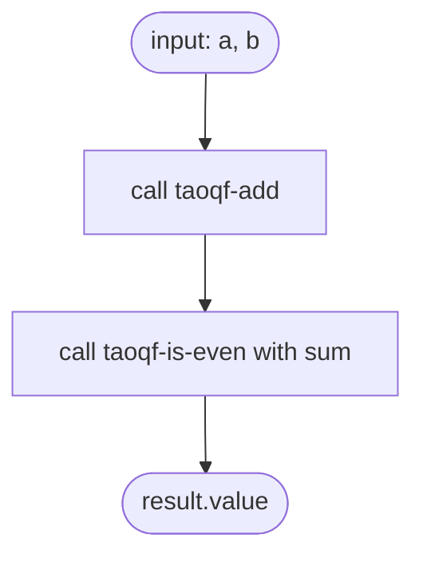

# taoqf-caller

Composition example: calls `taoqf-add` and `taoqf-is-even` to compute sum and parity.

```mermaid
flowchart TD
  Input([input: a, b]) --> CallAdd["call taoqf-add"]
  CallAdd --> CallEven["call taoqf-is-even with sum"]
  CallEven --> Output([result.value])
```
