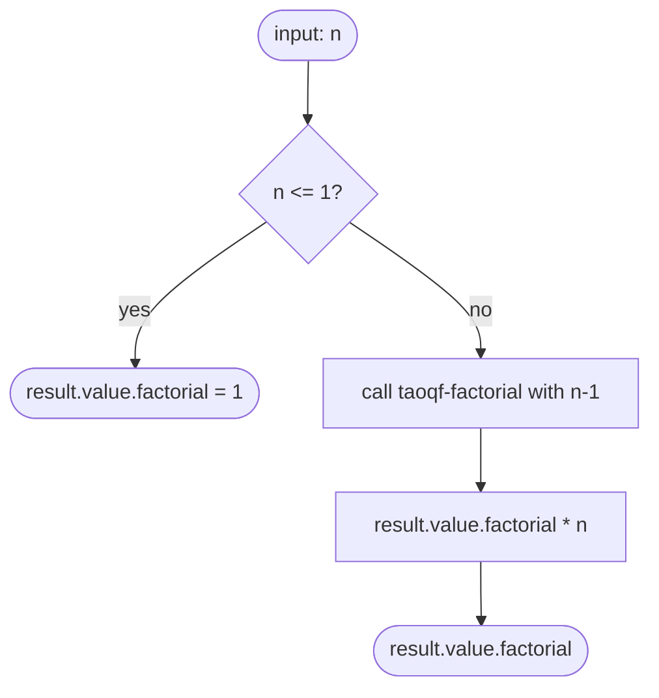

# taoqf-factorial

Recursive example: compute factorial.

```mermaid
flowchart TD
  Input([input: n]) --> Check{"n <= 1?"}
  Check -- yes --> Base([result.value.factorial = 1])
  Check -- no --> Recurse["call taoqf-factorial with n-1"]
  Recurse --> Multiply["result.value.factorial * n"]
  Multiply --> Output([result.value.factorial])
```
