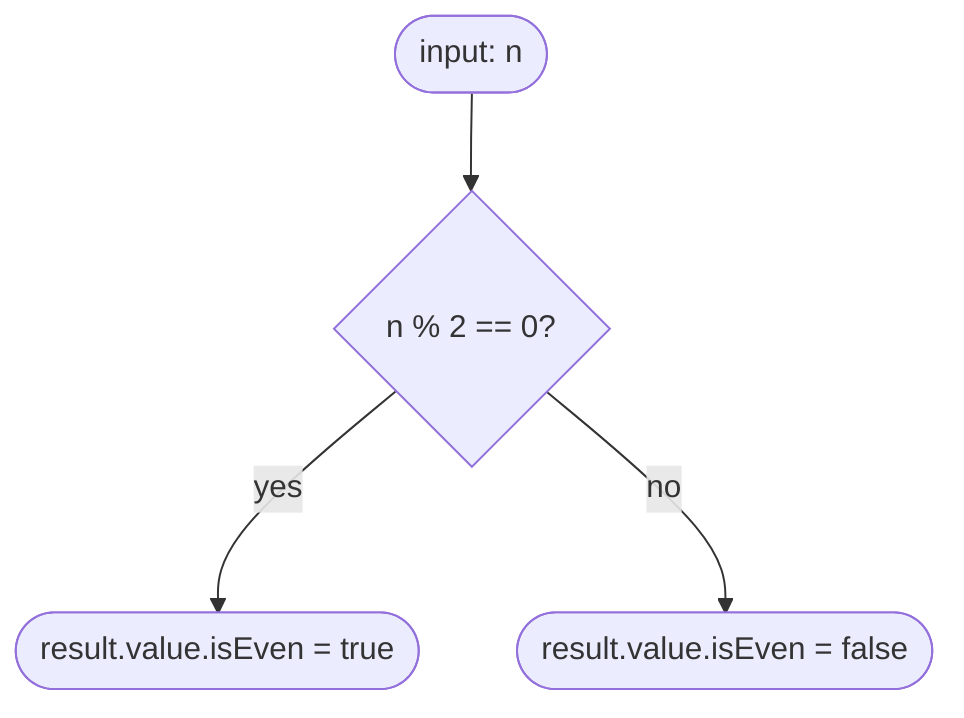

# taoqf-is-even

Branching example: returns whether a number is even.

```mermaid
flowchart TD
  Input([input: n]) --> Check{"n % 2 == 0?"}
  Check -- yes --> True([result.value.isEven = true])
  Check -- no --> False([result.value.isEven = false])
```
