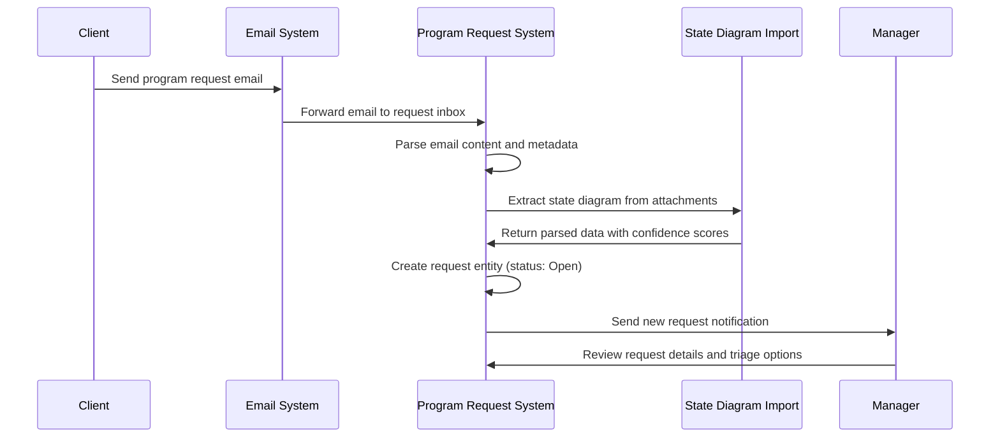
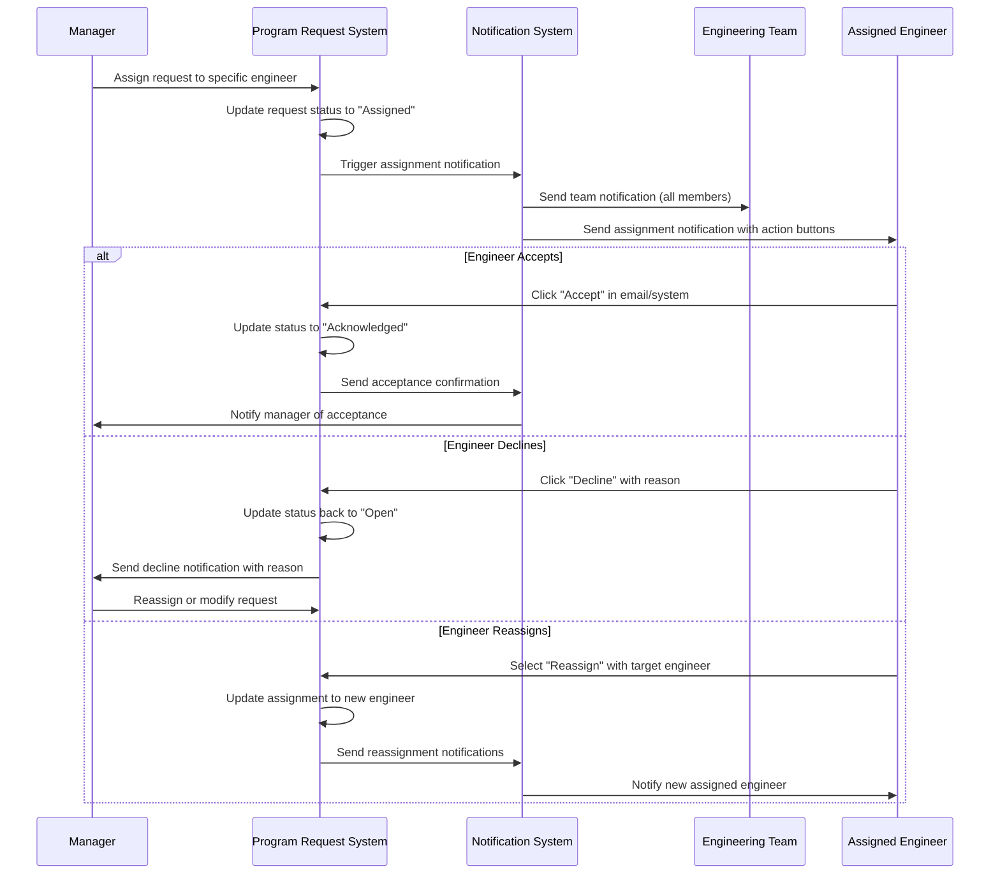
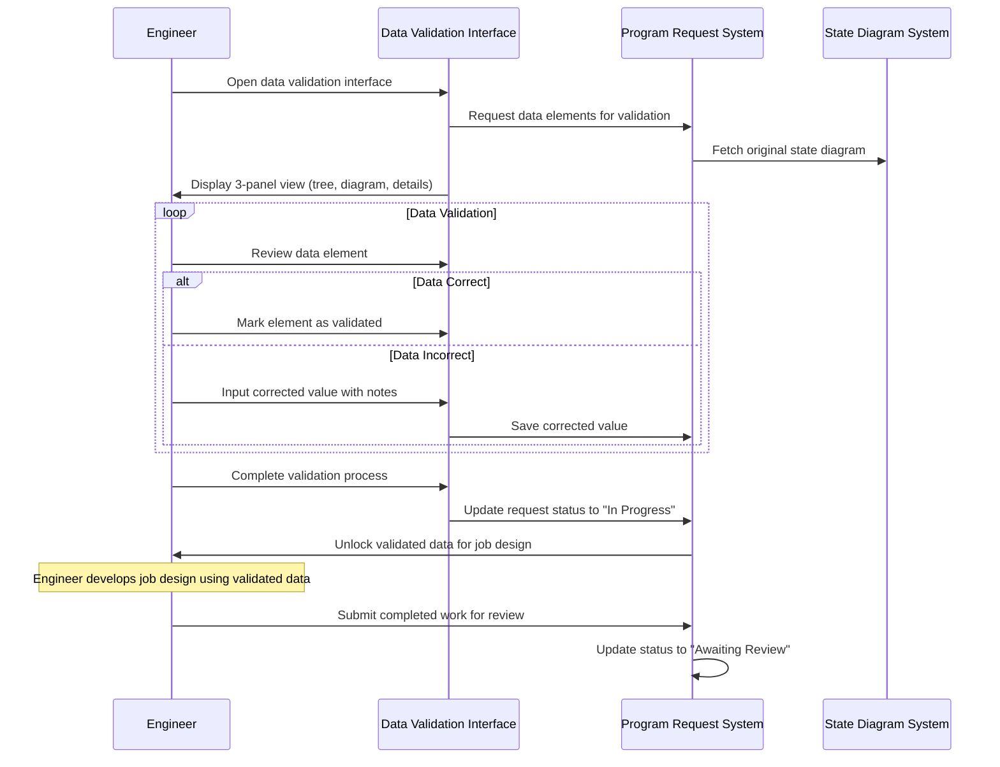
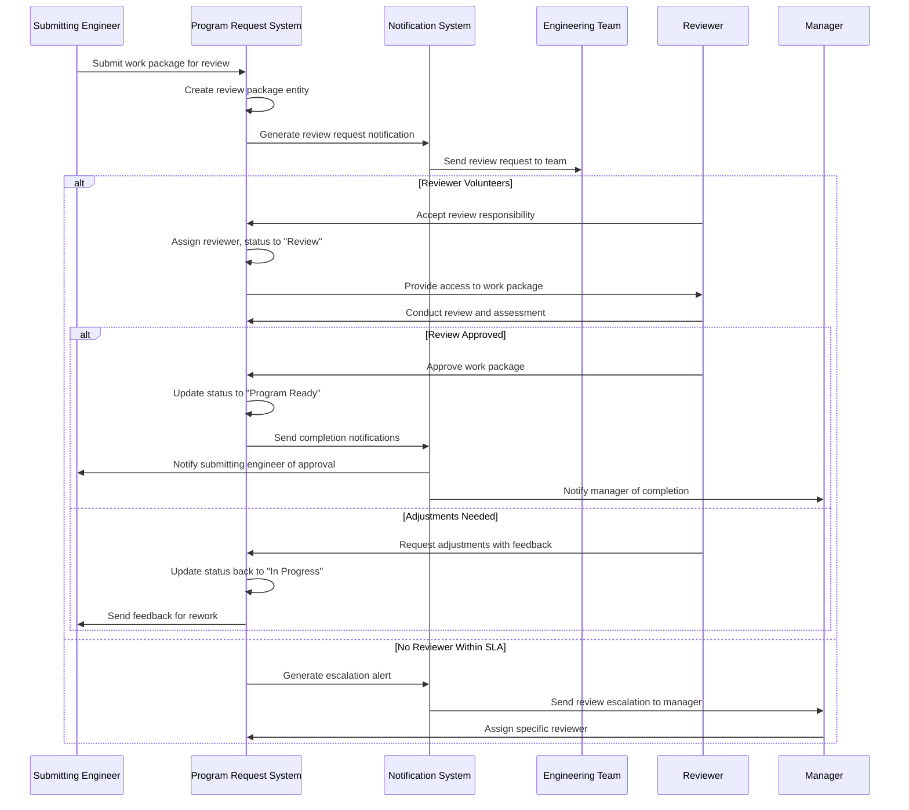
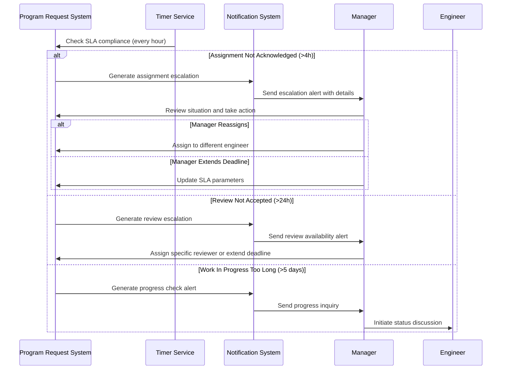
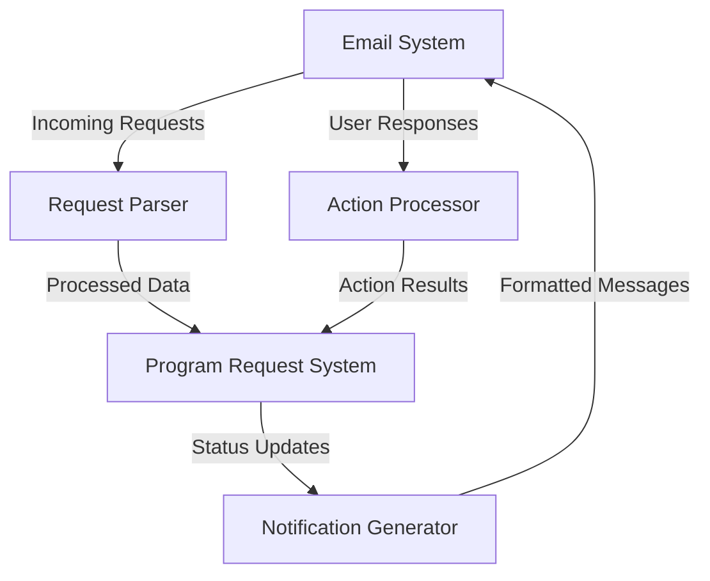
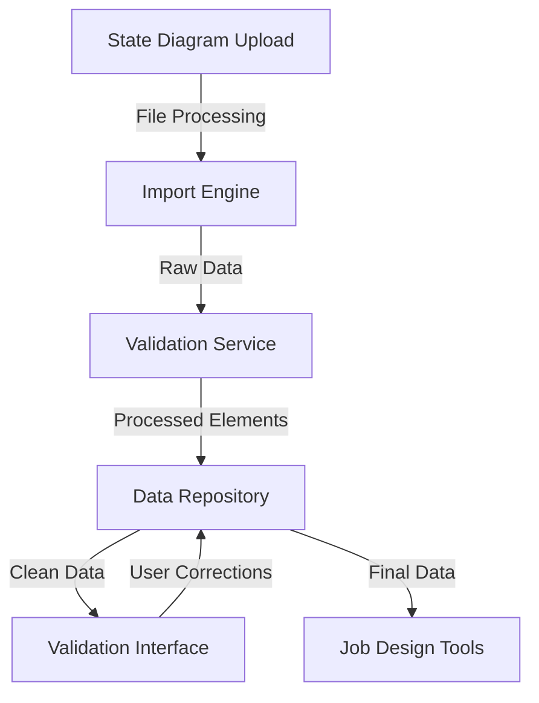

<!-- Identifier: C-01 -->

# Collaboration: Program Request Management

## Collaboration Overview
This document defines the interaction patterns, communication flows, and collaboration sequences for the Program Request Management process. It covers both human-to-human and human-to-system interactions throughout the complete workflow lifecycle.

## Primary Interaction Patterns

### 1. Request Intake and Initial Processing



### 2. Assignment and Acknowledgment Flow



### 3. Data Validation and Work Process



### 4. Peer Review and Quality Assurance



### 5. Escalation and Exception Handling



## Cross-Cutting Collaboration Patterns

### Communication Templates

#### Assignment Notification
```
Subject: Program Request Assignment - [Request ID] - [Client Name]

[Engineer Name],

You have been assigned a new program request:

Request Details:
- Request ID: [ID]
- Client: [Client Name] 
- Priority: [Priority Level]
- Created: [Date]
- Estimated Complexity: [Level]

Actions Available:
[Accept Assignment] [Decline Assignment] [Reassign Request]

Team members copied: [Team List]

View full details: [Request Link]
```

#### Review Request Notification
```  
Subject: Peer Review Request - [Request ID] - [Client Name]

Engineering Team,

A completed work package is ready for peer review:

Work Details:
- Request ID: [ID]
- Submitting Engineer: [Name]
- Work Type: [Type] 
- Submitted: [Date]
- Review SLA: 48 hours

First to accept review responsibility will be assigned.

[Accept Review] [View Work Package]

Submitting engineer available for questions: [Contact]
```

### Collaborative Decision Points

#### Assignment Decision Matrix
| Factor | Weight | Criteria |
|--------|--------|----------|
| Current Workload | 40% | Active requests vs capacity |
| Technical Expertise | 30% | Matching specialization areas |
| Client Familiarity | 20% | Previous client work experience |
| Availability Status | 10% | Current availability flag |

#### Review Assignment Logic
1. **Open Request**: Send to all team members
2. **Volunteer Basis**: First acceptance wins assignment  
3. **Conflict Resolution**: Senior engineer preference
4. **Escalation**: Manager assignment after 24h
5. **Independence**: Different engineer than submitter

### Quality Collaboration Standards

#### Data Validation Collaboration
- **Engineer Responsibility**: Thorough validation with documentation
- **System Support**: Confidence scoring and flagged discrepancies  
- **Peer Consultation**: Available for complex validation questions
- **Audit Trail**: Complete record of validation decisions and corrections

#### Review Collaboration Standards
- **Constructive Feedback**: Specific, actionable improvement suggestions
- **Technical Standards**: Adherence to engineering quality benchmarks
- **Documentation Quality**: Clear, complete, and professional outputs
- **Knowledge Sharing**: Learning opportunities for both reviewer and submitter

## Integration Collaboration Points

### External System Interfaces

#### Email System Collaboration


#### State Diagram Integration  


### Human-System Collaboration Optimization

#### Interface Design Principles
- **Three-Panel Validation**: Simultaneous view of data tree, diagram, and details
- **One-Click Actions**: Accept/Decline/Reassign via email buttons
- **Progressive Disclosure**: Show details on demand to avoid interface clutter
- **Real-time Updates**: Immediate status reflection across all user sessions

#### Workflow Automation Balance  
- **Automated**: Email parsing, status transitions, notification generation
- **Human-Guided**: Assignment decisions, data validation, quality review
- **Hybrid**: Exception handling with automated alerts and human resolution
- **Escalation**: Systematic escalation with human override capabilities

## Performance and Efficiency Collaboration

### Team Coordination Metrics
- **Response Time**: Average acknowledgment and review acceptance times
- **Distribution Balance**: Workload equity across engineering team
- **Collaboration Quality**: Feedback effectiveness and rework frequency
- **Knowledge Transfer**: Cross-training and skill development tracking

### Continuous Improvement Collaboration
- **Weekly Reviews**: Team discussion of process efficiency and pain points
- **Quarterly Assessment**: Stakeholder feedback and process optimization
- **Tool Enhancement**: User experience improvements based on usage patterns
- **Training Updates**: Process changes and best practice sharing

This collaboration framework ensures effective coordination between all stakeholders while maintaining process efficiency and quality outcomes.