<!-- Identifier: DM-01 -->

# Domain Model: Program Request Management

## Actors

### Human Actors

#### Manager  
- **Type**: Human
- **Examples**: Jeremy, Warren
- **Responsibilities**: 
  - Assign requests to appropriate engineering resources
  - Manage escalations and workload balancing
  - Override automatic triage decisions when needed
  - Monitor team performance and process efficiency
- **Interactions**: Creates assignments, reviews escalations, manages team capacity
- **Authority Level**: Can reassign any request, access all team metrics

#### Engineer  
- **Type**: Human
- **Examples**: Henry, Jason
- **Responsibilities**:
  - Accept, decline, or reassign incoming request assignments  
  - Validate and correct automatically imported data
  - Perform technical job design and development work
  - Submit completed work for peer review
- **Interactions**: Processes assignments, validates data, creates programs, collaborates in reviews
- **Authority Level**: Can modify own assignments and work products

#### Reviewer
- **Type**: Human
- **Pool**: Engineering Team Members
- **Responsibilities**:
  - Accept review responsibilities for completed work
  - Conduct technical quality assessment and validation  
  - Provide constructive feedback and approval decisions
  - Ensure work meets engineering standards and requirements
- **Interactions**: Reviews work packages, provides feedback, approves or requests adjustments
- **Authority Level**: Can approve work or require modifications

#### System Administrator
- **Type**: Human  
- **Team**: IT Operations
- **Responsibilities**:
  - Manage user roles and access permissions
  - Configure system integrations with email and external systems
  - Maintain system performance and availability
  - Support troubleshooting and process improvements
- **Interactions**: Configures system, manages access, provides technical support
- **Authority Level**: Full system configuration and user management

### System Actors

#### Email Integration System
- **Type**: External System
- **Purpose**: Automated request intake and stakeholder notifications
- **Interfaces**: SMTP/IMAP for email processing, webhook callbacks for status updates
- **Key Functions**: Parse incoming emails, extract attachments, send formatted notifications

#### State Diagram Import System  
- **Type**: External System
- **Purpose**: Extract engineering data from technical diagrams and documents
- **Interfaces**: File processing APIs, data validation services
- **Key Functions**: Parse technical documents, extract structured data, provide validation interfaces

#### Authentication Directory
- **Type**: External System (Active Directory)
- **Purpose**: User identity management and role-based access control
- **Interfaces**: LDAP/SAML authentication, group membership APIs
- **Key Functions**: Authenticate users, provide role information, manage team memberships

## Domain Class Model

### Core Entity Relationships *(Diagram DM-001)*
**Source Requirements**: R-001, R-003, R-005, R-008, R-013, R-017  
**Domain Area**: Core Workflow Entities

### Status and Type Enumerations *(Diagram DM-002)*
**Source Requirements**: R-003, R-004, R-006, R-009, R-010, R-016, R-018  
**Domain Area**: Workflow State Management

```mermaid
classDiagram
    class StatusEnum:::enum {
        <<enumeration>>
        OPEN
        ASSIGNED
        ACKNOWLEDGED
        IN_PROGRESS
        AWAITING_REVIEW
        REVIEW
        PROGRAM_READY
        +getNextValidStates(): StatusEnum[]
        +canTransitionTo(target): Boolean
    }
    
    class PriorityEnum:::enum {
        <<enumeration>>
        HIGH
        MEDIUM
        LOW
        URGENT
        +getEscalationTime(): Integer
    }
    
    class AvailabilityEnum:::enum {
        <<enumeration>>
        AVAILABLE
        BUSY
        UNAVAILABLE
        +canAcceptAssignment(): Boolean
    }
    
    class ValidationEnum:::enum {
        <<enumeration>>
        PENDING
        VALIDATED
        CORRECTED
        APPROVED
        +isComplete(): Boolean
    }
    
    class ElementTypeEnum:::enum {
        <<enumeration>>
        MEASUREMENT
        SPECIFICATION
        CALCULATION
        REFERENCE
        +getValidationPattern(): String
    }
    
    class ReviewStatusEnum:::enum {
        <<enumeration>>
        SUBMITTED
        IN_REVIEW
        APPROVED
        ADJUSTMENTS_NEEDED
        +isFinalized(): Boolean
    }
    
    class DiagramTypeEnum:::enum {
        <<enumeration>>
        WELL_SCHEMATIC
        PROCESS_FLOW
        TECHNICAL_SPEC
        +getParsingRules(): String[]
    }
    
    class NotificationTypeEnum:::enum {
        <<enumeration>>
        ASSIGNMENT
        STATUS_CHANGE
        ESCALATION
        REVIEW_REQUEST
        +getTemplate(): String
    }
    
    %% Styling
    classDef enum fill:#fff3e0
```

### System Integration Architecture *(Diagram DM-003)*
**Source Requirements**: R-001, R-002, R-007, R-013, R-014  
**Domain Area**: External System Integration

## Key Entities

### Request
- **Definition**: Program request submitted for engineering work with complete lifecycle tracking
- **Attributes**:
  - `request_id` (identifier): Unique request identifier
  - `status` (enumeration): Current workflow status [open, assigned, acknowledged, in_progress, awaiting_review, review, program_ready]
  - `created_date` (datetime): Request creation timestamp  
  - `priority` (enumeration): Request priority level [high, medium, low, urgent]
  - `client_id` (identifier): Associated client identifier
  - `source_email` (string): Originating email content and metadata
  - `assigned_engineer_id` (identifier): Currently assigned engineer
  - `assigned_by` (identifier): Manager who made the assignment
  - `acknowledgment_date` (datetime): When engineer accepted assignment
  - `completion_date` (datetime): When work was approved and finalized
- **Relationships**: 
  - Assigned to one Engineer
  - Created by one Manager  
  - Reviewed by one Reviewer
  - Contains multiple Data Elements
- **Domain Area**: Core Workflow
- **Lifecycle**: Creation → Assignment → Acknowledgment → Processing → Review → Completion

### Engineer
- **Definition**: Engineering staff member who processes requests and develops technical solutions
- **Attributes**:
  - `engineer_id` (identifier): Unique engineer identifier
  - `name` (string): Engineer full name
  - `email` (string): Contact email address
  - `team` (string): Engineering team membership
  - `specializations` (list): Technical expertise areas
  - `active_requests` (list): Currently assigned and in-progress requests
  - `workload_capacity` (integer): Maximum concurrent request capacity
  - `availability_status` (enumeration): Current availability [available, busy, unavailable]
- **Relationships**:
  - Has multiple assigned Requests
  - Member of one Engineering Team
  - Reports to one Manager
  - Participates in Peer Reviews
- **Domain Area**: Resource Management
- **Operations**: Accept assignment, validate data, create program, submit for review

### Data Element
- **Definition**: Structured data extracted from state diagrams and engineering documents
- **Attributes**:
  - `element_id` (identifier): Unique data element identifier
  - `request_id` (identifier): Associated request reference
  - `element_type` (enumeration): Type of data element [measurement, specification, calculation, reference]
  - `raw_value` (string): Originally parsed value from document
  - `validated_value` (string): Engineer-corrected and approved value
  - `validation_status` (enumeration): Validation state [pending, validated, corrected, approved]
  - `source_location` (string): Location reference in source document
  - `validation_notes` (string): Engineer comments and corrections
- **Relationships**:
  - Belongs to one Request
  - Validated by one Engineer
  - Sourced from one State Diagram
- **Domain Area**: Data Management
- **Quality Requirements**: Must be validated before use in job design

### State Diagram  
- **Definition**: Engineering diagram containing technical specifications and design parameters
- **Attributes**:
  - `diagram_id` (identifier): Unique diagram identifier  
  - `diagram_name` (string): Descriptive diagram name
  - `file_path` (string): Storage location of diagram file
  - `version` (string): Diagram version or revision number
  - `import_date` (datetime): When diagram was processed by system
  - `parsing_confidence` (float): System confidence in data extraction (0.0-1.0)
  - `client_id` (identifier): Associated client reference
  - `diagram_type` (enumeration): Type classification [well_schematic, process_flow, technical_spec]
- **Relationships**: 
  - Contains multiple Data Elements
  - Associated with multiple Requests  
  - Belongs to one Client
- **Domain Area**: Document Management
- **Processing**: Automated parsing with human validation overlay

### Review Package
- **Definition**: Complete work package submitted for peer review and quality assessment
- **Attributes**:
  - `package_id` (identifier): Unique review package identifier
  - `request_id` (identifier): Associated request reference
  - `submitting_engineer_id` (identifier): Engineer who created the work
  - `assigned_reviewer_id` (identifier): Engineer assigned to review
  - `submission_date` (datetime): When package was submitted for review
  - `review_completion_date` (datetime): When review was completed
  - `review_status` (enumeration): Review progress [submitted, in_review, approved, adjustments_needed]
  - `work_summary` (string): Description of completed work
  - `review_feedback` (string): Reviewer comments and recommendations
- **Relationships**:
  - References one Request
  - Submitted by one Engineer
  - Reviewed by one Reviewer  
  - Contains multiple Work Products
- **Domain Area**: Quality Management
- **SLA**: 48-hour review completion target

### Notification
- **Definition**: System-generated communication to stakeholders about request status and actions
- **Attributes**:
  - `notification_id` (identifier): Unique notification identifier
  - `request_id` (identifier): Associated request reference
  - `recipient_type` (enumeration): Target audience [assigned_engineer, team, manager, all]
  - `notification_type` (enumeration): Message category [assignment, status_change, escalation, review_request]
  - `delivery_method` (enumeration): Communication channel [email, system_alert, dashboard]
  - `sent_date` (datetime): When notification was dispatched
  - `content` (string): Notification message content
  - `action_buttons` (list): Available actions [accept, decline, reassign, review]
- **Relationships**:
  - References one Request
  - Sent to one or more Engineers/Managers
  - May trigger Workflow Actions
- **Domain Area**: Communication Management
- **Delivery**: Real-time with email integration

## Systems and Components

### Program Request Management System (Core)
- **Purpose**: Central workflow orchestration and data management
- **Interfaces**: Web application, REST APIs, email integration endpoints
- **Key Functions**: 
  - Request lifecycle management
  - Status tracking and notifications
  - User role and permission management
  - Process automation and routing
- **Data Storage**: Request repository, audit trails, performance metrics

### Data Validation Interface
- **Purpose**: Three-panel validation interface for engineer data review
- **Interfaces**: Web-based interactive interface with drag-and-drop capabilities
- **Key Functions**:
  - Display data tree, state diagram, and detail views simultaneously
  - Enable real-time data correction and validation
  - Provide visual mapping between diagram and extracted data
  - Track validation progress and completion status
- **Integration**: Direct connection to core system and state diagram repository

### Email Notification Gateway
- **Purpose**: Bidirectional email communication with embedded action capabilities
- **Interfaces**: SMTP/IMAP protocols, webhook callbacks for action responses
- **Key Functions**:
  - Format and send contextualized notifications
  - Process email-based action responses (accept/decline buttons)
  - Maintain communication audit trail
  - Support both team-wide and targeted notifications
- **Security**: Encrypted communication, authenticated action processing

### State Diagram Import Engine
- **Purpose**: Automated parsing and data extraction from engineering diagrams
- **Interfaces**: File upload APIs, document parsing libraries, data validation services
- **Key Functions**:
  - Parse PDF and CAD files for structured data
  - Extract measurements, specifications, and reference data
  - Provide confidence scores for extracted information
  - Generate validation datasets for human review
- **Quality Assurance**: Machine learning validation with human oversight requirements

## Domain Relationships

### Primary Workflows
- **Request Assignment**: Manager → assigns → Request → notifies → Engineer
- **Data Validation**: Engineer → validates → Data Elements → updates → Request status  
- **Peer Review**: Engineer → submits → Review Package → assigns → Reviewer
- **Process Completion**: Reviewer → approves → Request → generates → Program Output

### Information Dependencies
- **Request Processing**: Requires validated State Diagram data before job design
- **Assignment Decisions**: Based on Engineer availability and specialization matching
- **Review Assignment**: Dependent on team availability and expertise requirements
- **Escalation Triggers**: Based on SLA timeouts and acknowledgment responses

### Data Integrity Requirements
- **Request Uniqueness**: Each request must have unique identifier and client association
- **Assignment Consistency**: Request can only be assigned to one Engineer at a time
- **Review Independence**: Reviewer cannot be the same as submitting Engineer
- **Validation Completeness**: All Data Elements must be validated before job design begins