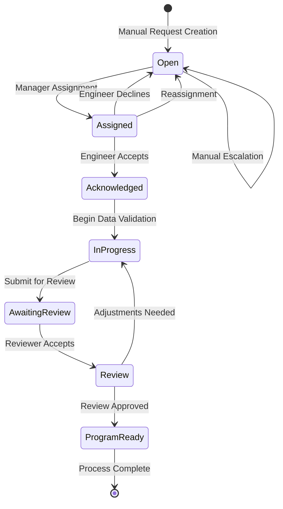

<!-- Identifier: P-01 -->

# Process: Program Request Management

## Process Overview
The Program Request Management process defines the complete workflow for processing engineering program requests from initial submission through final program delivery. **Phase 1 Strategy**: The process emphasizes manual interfaces for all functions, clear status tracking, collaborative assignment management, and structured quality assurance to enable MVP validation before automation investment.

## Process Goals

### Phase 1 (MVP - Manual Interface)
- Provide efficient manual interfaces for all workflow functions
- Enable rapid MVP deployment and requirement validation
- Provide real-time visibility into request status for all stakeholders  
- Enable efficient engineer workload management through web interfaces
- Ensure quality control through manual peer review workflows
- Generate complete job design ready for operational deployment
- **Validate workflow effectiveness before automation investment**

### Future Phase (Automation Enhancement)
- Achieve 80% reduction in manual processing through automation
- Implement intelligent auto-triage and escalation systems

## Workflow States

### State Definitions

| Status | Description | Entry Conditions | Duration | Next Actions |
|--------|-------------|-----------------|----------|--------------|
| **Open** | New request, not yet assigned | Request created, Engineer declined, Request unassigned | Target: <24h | Manager assignment, Auto-triage |
| **Assigned** | Assigned to engineer, awaiting acknowledgment | Manager assigns request | Target: <4h | Engineer accept/decline/reassign |  
| **Acknowledged** | Engineer accepted assignment | Engineer accepts assignment | Brief transition | Begin data validation |
| **In Progress** | Engineer working on request | Engineer begins data validation | Variable (days) | Submit for review |
| **Awaiting Review** | Work submitted for team review | Engineer submits for review | Target: <24h | Team member accepts review |
| **Review** | Review in progress by team member | Team member accepts review | Target: <48h | Approve or request adjustments |
| **Program Ready** | Approved and ready for next phase | Review approved | End state | Process completion |

## Process Activities

### 1. Request Intake and Creation

**Activity**: Manual Request Creation Interface
- **Trigger**: User accesses request creation form
- **Actor**: Manager or authorized user
- **Actions**:
  - Complete structured request form with client and project information
  - Upload state diagram files and attachments
  - Enter initial priority and categorization
  - Submit request for processing
- **System Actions**:
  - Validate form completeness and data integrity
  - Generate unique request identifier
  - Store request with "Open" status
  - **Future**: Automated email parsing (Phase 2)
- **Outputs**: 
  - New request in "Open" status ready for assignment
- **SLA**: <15 minutes for form completion

**Activity**: Initial Request Assessment  
- **Trigger**: Request created in Open status
- **Actor**: Manager
- **Actions**:
  - Review request details and attachments
  - Categorize request type and complexity
  - Identify potential engineer matches based on workload and expertise
  - Set priority based on business requirements
- **Outputs**: Request ready for assignment with manager assessment

### 2. Assignment and Acknowledgment

**Activity**: Manager Assignment
- **Actor**: Manager (Jeremy, Warren)
- **Trigger**: Request in Open status
- **Actions**:  
  - Review request details and suggested assignments
  - Assign to specific engineer based on workload and expertise
  - Override auto-triage suggestions if needed
- **System Actions**:
  - Change status to "Assigned"
  - Send notification to entire team (not just assigned engineer)
  - Start acknowledgment timer
- **SLA**: <24 hours

**Activity**: Engineer Response
- **Actor**: Assigned Engineer 
- **Trigger**: Request assigned notification received via web interface
- **Actions Available**:
  - **Accept**: Acknowledge assignment and proceed via web interface
  - **Decline**: Reject with reason through web form (returns to Open)
  - **Reassign**: Transfer to another engineer with justification via web interface
- **System Actions**:
  - Process response selection via web interface
  - Update status based on engineer choice
  - Send follow-up notifications via system dashboard
  - **Future**: Email button integration (Phase 2)
- **SLA**: <4 hours

**Activity**: Escalation Management
- **Trigger**: No engineer response within SLA
- **Actions**:
  - Manual escalation alert via dashboard notifications
  - Manager review of unacknowledged assignments
  - Manual reassignment based on workload assessment
- **System Actions**:
  - Log unacknowledged status for reporting
  - Generate escalation reports for management review
  - **Future**: Auto-escalation and auto-reassignment (Phase 2)
- **Manual Actions**: Manager intervention and reassignment

### 3. Data Validation and Work Process

**Activity**: Manual Data Entry Setup  
- **Actor**: Engineer
- **Trigger**: Request acknowledgment completed
- **Actions**:
  - Access manual data entry interface
  - Review uploaded state diagram files and documentation
  - Begin structured data entry using guided forms
- **System Actions**:
  - Change status to "In Progress" upon interface access
  - Provide data entry forms with validation rules
  - Track data entry progress and completeness
  - **Future**: Automated parsing assistance (Phase 2)

**Activity**: Manual Data Entry and Validation
- **Actor**: Engineer
- **Process**:
  1. Enter state diagram data using structured forms
  2. Validate entries against business rules and constraints
  3. Review and cross-check data for completeness
  4. Use validation interface to ensure data accuracy
  5. Approve final dataset for job design
- **System Actions**:
  - Provide real-time validation feedback
  - Generate audit trail of data entries
  - Lock data for job design work once validated
  - **Future**: Automated parsing with manual correction (Phase 2)

**Activity**: Job Design Development
- **Actor**: Engineer  
- **Process**:
  1. Use validated data for technical design work
  2. Develop comprehensive program specifications
  3. Generate required documentation and outputs
  4. Prepare work package for peer review
- **Duration**: Variable based on complexity (typically 1-5 days)

### 4. Review and Quality Assurance

**Activity**: Review Submission
- **Actor**: Engineer
- **Trigger**: Job design work completed
- **Actions**:
  - Compile completed work package
  - Submit for team review with work summary
  - Include any specific review focus areas
- **System Actions**:
  - Change status to "Awaiting Review" 
  - Notify entire engineering team of review availability
  - Create review task in queue

**Activity**: Review Assignment
- **Actor**: Engineering Team Member
- **Trigger**: Review notification received
- **Process**:
  - Review team member volunteers for review task
  - System assigns review to first volunteer
  - Status changes to "Review" with assigned reviewer
- **SLA**: <24 hours for review acceptance

**Activity**: Peer Review Process  
- **Actor**: Assigned Reviewer
- **Process**:
  1. Review work package for technical accuracy
  2. Validate against requirements and standards
  3. Check data validation quality and completeness
  4. Provide feedback and recommendations
- **Outcomes**:
  - **Approved**: Work meets standards, proceed to Program Ready
  - **Adjustments Needed**: Return to In Progress with specific feedback
- **SLA**: <48 hours for review completion

### 5. Process Completion

**Activity**: Final Approval  
- **Trigger**: Peer review approved
- **System Actions**:
  - Change status to "Program Ready"  
  - Generate final program package
  - Notify stakeholders of completion
  - Archive request with full audit trail
- **Outputs**:
  - Complete job design ready for operational deployment
  - Audit trail and quality documentation
  - Performance metrics for process improvement

## Escalation Procedures

### Assignment Escalation
- **Trigger**: No engineer acknowledgment within 4 hours
- **Actions**: Manager notification, workload review, potential reassignment
- **Resolution**: Manual intervention by management

### Review Escalation  
- **Trigger**: No review acceptance within 24 hours
- **Actions**: Management notification, resource allocation review
- **Resolution**: Management assignment of reviewer

### Quality Escalation
- **Trigger**: Multiple adjustment cycles or significant quality concerns
- **Actions**: Senior engineer involvement, process review
- **Resolution**: Additional mentoring or process improvements

## Integration Points

### Email Integration
- **Incoming**: Designated request inbox monitoring
- **Outgoing**: Status notifications, assignment alerts, review requests
- **Requirements**: Secure email processing with attachment handling

### State Diagram Integration  
- **Function**: Automated import and parsing of engineering diagrams
- **Validation**: Data integrity checks and human validation interface
- **Storage**: Secure document management with version control

### User Management Integration
- **Authentication**: AD integration for role-based access
- **Teams**: Engineering team membership and manager hierarchies  
- **Permissions**: Role-based workflow access and action restrictions

## Performance Metrics

### Throughput Metrics
- Requests processed per engineer per period
- Average time in each workflow state
- End-to-end process completion time

### Quality Metrics  
- Data validation accuracy rates
- Review pass rates (first-time approval)
- Rework frequency and reasons

### Efficiency Metrics
- Automated vs manual triage success rate
- Acknowledgment response time compliance
- Review assignment and completion timeliness

## Process Variations

### Express Processing
- **Criteria**: Urgent requests or simple program types  
- **Modifications**: Accelerated SLAs, priority reviewer assignment
- **Approval**: Manager override required

### Complex Program Handling
- **Criteria**: Multi-phase programs or novel technical challenges
- **Modifications**: Senior engineer review, extended validation time
- **Approval**: Technical lead involvement required