# Program Request Management - PERT Analysis

## Project Overview
**Project**: Program Request Management  
**ID**: PRG-01  
**Type**: ASP .NET Blazor Web Application  
**Purpose**: Program request management system  
**Duration**: 12 weeks (February 24 - May 16, 2026)
**Total Effort**: 59.8 days with 80% confidence range of 53.9-65.7 days

## Stakeholders
- Product Owner: Requirements and business validation
- Engineering: Technical development and architecture (1-2 developers)
- Sales: Business requirements and user experience
- IT: Infrastructure and deployment support

## Task Network Diagram

```mermaid
graph LR
    Start([Project Start]) --> T001[T001: Project Setup]
    T001 --> T002[T002: Database Design]
    T001 --> T003[T003: User Role System]
    T001 --> T004[T004: Architecture Docs]
    T001 --> T005[T005: Dev Standards]
    T002 --> T006[T006: Email Integration]
    T002 --> T007[T007: Request Entity]
    T006 --> T008[T008: Request Dashboard]
    T007 --> T009[T009: Priority Rules]
    T008 --> T010[T010: Request Detail View]
    T009 --> T010
    T003 --> T011[T011: User Management]
    T010 --> T012[T012: Assignment System]
    T011 --> T013[T013: Email Notifications]
    T012 --> T013
    T013 --> T014[T014: Response Processing]
    T013 --> T015[T015: Communication Hub]
    T014 --> T016[T016: Assignment Security]
    T015 --> T016
    T010 --> T017[T017: State Diagram Import]
    T017 --> T018[T018: Data Validation]
    T018 --> T019[T019: Data Correction]
    T018 --> T020[T020: Validation Workflow]
    T019 --> T021[T021: Peer Review]
    T020 --> T021
    T021 --> T022[T022: Review Approval]
    T022 --> T023[T023: Review Adjustment]
    T022 --> T024[T024: Review Metrics]
    T016 --> T025[T025: SharePoint Integration]
    T023 --> T026[T026: Integration Testing]
    T024 --> T026
    T025 --> T026
    T026 --> T027[T027: Performance Testing]
    T026 --> T028[T028: Security Testing]
    T026 --> T029[T029: UAT Preparation]
    T027 --> T030[T030: Documentation]
    T028 --> T030
    T029 --> T030
    T030 --> T031[T031: Deployment Prep]
    T031 --> T032[T032: Post-Deploy Support]
    T032 --> End([Project Complete])
```

## Task Estimates (Three-Point Estimation)

| Task ID | Task Name | Optimistic (O) | Most Likely (M) | Pessimistic (P) | Expected Time (TE) | Variance (V) |
|---------|-----------|----------------|-----------------|-----------------|-------------------|--------------|
| T001 | Project Setup and Blazor Architecture | 1.0 days | 1.8 days | 3.0 days | 1.83 days | 0.11 |
| T002 | Database Design and Entity Framework | 1.5 days | 2.1 days | 3.5 days | 2.20 days | 0.11 |
| T003 | User Role and Permission System | 1.0 days | 1.7 days | 3.0 days | 1.78 days | 0.11 |
| T004 | System Architecture Documentation | 0.5 days | 0.9 days | 1.5 days | 0.93 days | 0.03 |
| T005 | Development Environment Standards | 0.3 days | 0.5 days | 1.0 days | 0.55 days | 0.01 |
| T006 | Email Integration Service | 2.5 days | 3.7 days | 6.0 days | 3.87 days | 0.34 |
| T007 | Request Entity and Status Management | 1.5 days | 2.5 days | 4.0 days | 2.58 days | 0.17 |
| T008 | Request Dashboard and List Views | 1.0 days | 1.9 days | 3.0 days | 1.98 days | 0.11 |
| T009 | Priority and Escalation Rule Engine | 1.5 days | 2.5 days | 4.0 days | 2.58 days | 0.17 |
| T010 | Request Detail View and Edit Interface | 1.0 days | 1.5 days | 2.5 days | 1.58 days | 0.06 |
| T011 | User Management and Profile System | 1.0 days | 2.0 days | 3.5 days | 2.08 days | 0.17 |
| T012 | Assignment Management System | 1.5 days | 2.5 days | 4.0 days | 2.58 days | 0.17 |
| T013 | Email Notification System | 2.0 days | 3.2 days | 5.0 days | 3.30 days | 0.25 |
| T014 | Assignment Response Processing | 1.0 days | 2.0 days | 3.5 days | 2.08 days | 0.17 |
| T015 | Team Communication Hub | 1.0 days | 1.5 days | 2.5 days | 1.58 days | 0.06 |
| T016 | Assignment Security and Authorization | 0.5 days | 1.0 days | 2.0 days | 1.08 days | 0.06 |
| T017 | State Diagram Import Service | 2.0 days | 3.1 days | 5.0 days | 3.22 days | 0.25 |
| T018 | Data Validation Interface | 2.0 days | 3.0 days | 4.5 days | 3.08 days | 0.17 |
| T019 | Data Correction and Version Management | 1.0 days | 2.0 days | 3.5 days | 2.08 days | 0.17 |
| T020 | Data Validation Completion Workflow | 1.0 days | 1.5 days | 2.5 days | 1.58 days | 0.06 |
| T021 | Peer Review System | 1.5 days | 2.5 days | 4.0 days | 2.58 days | 0.17 |
| T022 | Review Approval and Program Ready Status | 1.0 days | 2.0 days | 3.5 days | 2.08 days | 0.17 |
| T023 | Review Adjustment and Rework Process | 1.0 days | 1.5 days | 2.5 days | 1.58 days | 0.06 |
| T024 | Review Performance Metrics and Reporting | 0.5 days | 1.0 days | 2.0 days | 1.08 days | 0.06 |
| T025 | SharePoint Integration | 1.5 days | 2.5 days | 4.0 days | 2.58 days | 0.17 |
| T026 | System Integration Testing | 3.0 days | 4.8 days | 7.5 days | 5.05 days | 0.56 |
| T027 | Performance Testing and Optimization | 1.0 days | 2.0 days | 3.5 days | 2.08 days | 0.17 |
| T028 | Security Testing and Vulnerability Assessment | 1.5 days | 2.5 days | 4.0 days | 2.58 days | 0.17 |
| T029 | User Acceptance Testing Preparation | 1.0 days | 2.0 days | 3.5 days | 2.08 days | 0.17 |
| T030 | System Documentation and User Training | 2.0 days | 3.0 days | 4.5 days | 3.08 days | 0.17 |
| T031 | Production Deployment Preparation | 1.5 days | 2.5 days | 4.0 days | 2.58 days | 0.17 |
| T032 | Post-Deployment Support and Monitoring | 1.0 days | 1.5 days | 2.5 days | 1.58 days | 0.06 |

### Formulas Used
- **Expected Time (TE)**: (O + 4M + P) / 6
- **Variance (V)**: ((P - O) / 6)²
- **Standard Deviation (σ)**: √V

## Critical Path Analysis

### Path Analysis
| Path | Tasks | Total Duration | Is Critical |
|------|-------|----------------|-------------|
| Path 1 | Start → T001 → T002 → T006 → T008 → T010 → T017 → T018 → T021 → T022 → T026 → T030 → T031 → T032 → End | 58.32 days | **YES** |
| Path 2 | Start → T001 → T003 → T011 → T013 → T016 → T025 → T026 → T030 → T031 → T032 → End | 57.89 days | No |
| Path 3 | Start → T001 → T002 → T007 → T009 → T010 → T012 → T013 → T014 → T021 → T022 → T026 → T030 → T031 → T032 → End | 56.45 days | No |

### **Critical Path**: Start → T001 → T002 → T006 → T008 → T010 → T017 → T018 → T021 → T022 → T026 → T030 → T031 → T032 → End
- **Duration**: 58.32 days
- **Standard Deviation**: 1.47 days  
- **99% Confidence Interval**: 58.32 ± 3.52 days (54.8 - 61.84 days)

## Critical Tasks (Zero Slack)
- T001: Project Setup and Blazor Architecture
- T002: Database Design and Entity Framework
- T006: Email Integration Service  
- T008: Request Dashboard and List Views
- T010: Request Detail View and Edit Interface
- T017: State Diagram Import Service
- T018: Data Validation Interface
- T021: Peer Review System
- T022: Review Approval and Program Ready Status
- T026: System Integration Testing
- T030: System Documentation and User Training
- T031: Production Deployment Preparation
- T032: Post-Deployment Support and Monitoring

## Forward and Backward Pass Calculations

### Task Schedule Analysis Table

| Task | Duration | Predecessors | Successors | Early Start | Early Finish | Late Start | Late Finish | Total Slack | Free Slack | Critical |
|------|----------|-------------|------------|-------------|--------------|------------|-------------|-------------|------------|----------|
| T001 | 1.83     | Start       | T002,T003,T004,T005 | 0           | 1.83         | 0          | 1.83        | 0           | 0          | **Yes**  |
| T002 | 2.20     | T001        | T006,T007 | 1.83        | 4.03         | 1.83       | 4.03        | 0           | 0          | **Yes**  |
| T003 | 1.78     | T001        | T011      | 1.83        | 3.61         | 10.71      | 12.49       | 8.88        | 8.88       | No       |
| T004 | 0.93     | T001        | None      | 1.83        | 2.76         | 56.56      | 57.49       | 54.73       | 54.73      | No       |
| T005 | 0.55     | T001        | None      | 1.83        | 2.38         | 57.50      | 58.05       | 55.67       | 55.67      | No       |
| T006 | 3.87     | T002        | T008      | 4.03        | 7.90         | 4.03       | 7.90        | 0           | 0          | **Yes**  |
| T007 | 2.58     | T002        | T009      | 4.03        | 6.61         | 6.03       | 8.61        | 2.00        | 2.00       | No       |
| T008 | 1.98     | T006        | T010      | 7.90        | 9.88         | 7.90       | 9.88        | 0           | 0          | **Yes**  |
| T009 | 2.58     | T007        | T010      | 6.61        | 9.19         | 8.61       | 11.19       | 2.00        | 0.69       | No       |
| T010 | 1.58     | T008,T009   | T012,T017 | 9.88        | 11.46        | 9.88       | 11.46       | 0           | 0          | **Yes**  |
| T011 | 2.08     | T003        | T013      | 3.61        | 5.69         | 12.49      | 14.57       | 8.88        | 8.88       | No       |
| T012 | 2.58     | T010        | T013      | 11.46       | 14.04        | 14.99      | 17.57       | 3.53        | 0.53       | No       |
| T013 | 3.30     | T011,T012   | T014,T015 | 14.57       | 17.87        | 14.57      | 17.87       | 0           | 0          | No       |
| T014 | 2.08     | T013        | T021      | 17.87       | 19.95        | 19.87      | 21.95       | 2.00        | 2.00       | No       |
| T015 | 1.58     | T013        | T016      | 17.87       | 19.45        | 20.99      | 22.57       | 3.12        | 3.12       | No       |
| T016 | 1.08     | T015        | T025      | 19.45       | 20.53        | 22.57      | 23.65       | 3.12        | 3.12       | No       |
| T017 | 3.22     | T010        | T018      | 11.46       | 14.68        | 11.46      | 14.68       | 0           | 0          | **Yes**  |
| T018 | 3.08     | T017        | T019,T020 | 14.68       | 17.76        | 14.68      | 17.76       | 0           | 0          | **Yes**  |
| T019 | 2.08     | T018        | T021      | 17.76       | 19.84        | 19.87      | 21.95       | 2.11        | 2.11       | No       |
| T020 | 1.58     | T018        | T021      | 17.76       | 19.34        | 20.37      | 21.95       | 2.61        | 0.50       | No       |
| T021 | 2.58     | T014,T019,T020 | T022    | 21.95       | 24.53        | 21.95      | 24.53       | 0           | 0          | **Yes**  |
| T022 | 2.08     | T021        | T023,T024 | 24.53       | 26.61        | 24.53      | 26.61       | 0           | 0          | **Yes**  |
| T023 | 1.58     | T022        | T026      | 26.61       | 28.19        | 31.19      | 32.77       | 4.58        | 4.58       | No       |
| T024 | 1.08     | T022        | T026      | 26.61       | 27.69        | 31.69      | 32.77       | 5.08        | 5.08       | No       |
| T025 | 2.58     | T016        | T026      | 20.53       | 23.11        | 23.65      | 26.23       | 3.12        | 9.66       | No       |
| T026 | 5.05     | T023,T024,T025 | T027,T028,T029 | 32.77 | 37.82        | 26.61      | 31.66       | 0           | 0          | **Yes**  |
| T027 | 2.08     | T026        | T030      | 37.82       | 39.90        | 37.82      | 39.90       | 0           | 0          | No       |
| T028 | 2.58     | T026        | T030      | 37.82       | 40.40        | 37.32      | 39.90       | 0           | 0          | No       |
| T029 | 2.08     | T026        | T030      | 37.82       | 39.90        | 37.82      | 39.90       | 0           | 0          | No       |
| T030 | 3.08     | T027,T028,T029 | T031    | 40.40       | 43.48        | 40.40      | 43.48       | 0           | 0          | **Yes**  |
| T031 | 2.58     | T030        | T032      | 43.48       | 46.06        | 43.48      | 46.06       | 0           | 0          | **Yes**  |
| T032 | 1.58     | T031        | End       | 46.06       | 47.64        | 46.06      | 47.64       | 0           | 0          | **Yes**  |

### Slack Calculations
- **Total Slack**: LS - ES (or LF - EF) = Maximum delay without affecting project completion
- **Free Slack**: Minimum ES of successors - EF = Maximum delay without affecting successors
- **Critical Tasks**: Tasks with Total Slack = 0

## Risk Assessment
- **Schedule Risk**: High confidence (99%) project will complete within 61.84 days
- **Critical Path Sensitivity**: 13 tasks have zero slack - high sensitivity to delays
- **Resource Conflicts**: Multiple parallel paths can run simultaneously (verify resource availability)

## Detailed Project Phases

### Phase 1: Foundation & Infrastructure (8.2 days, Mar 5 complete)
**Critical Path Tasks:**
- **T001**: Project Setup and Blazor Architecture (1.83 days) - *Critical*
- **T002**: Database Design and Entity Framework Setup (2.20 days) - *Critical*

**Parallel Tasks:**
- **T003**: User Role and Permission System Design (1.78 days) - 8.88 days slack
- **T004**: System Architecture Documentation (0.93 days) - 54.73 days slack
- **T005**: Development Environment Standards (0.55 days) - 55.67 days slack

**Deliverables**: Blazor project structure, authentication framework, database schema, role-based access control, development standards

### Phase 2: Core Request Management (11.2 days, Mar 20 complete)
**Critical Path Tasks:**
- **T006**: Email Integration Service (3.87 days) - *Critical, High Risk*
- **T008**: Request Dashboard and List Views (1.98 days) - *Critical*
- **T010**: Request Detail View and Edit Interface (1.58 days) - *Critical*

**Supporting Tasks:**
- **T007**: Request Entity and Status Management (2.58 days) - 2.0 days slack
- **T009**: Priority and Escalation Rule Engine (2.58 days) - 2.0 days slack

**Deliverables**: Email-to-request automation, request lifecycle management, dashboard interfaces, priority and escalation rules

### Phase 3: Assignment & Notification System (10.1 days, Apr 3 complete)
**Supporting Tasks:**
- **T011**: User Management and Profile System (2.08 days) - 8.88 days slack
- **T012**: Assignment Management System (2.58 days) - 3.53 days slack
- **T013**: Email Notification System (3.30 days) - Non-critical but important
- **T014**: Assignment Response Processing (2.08 days) - 2.0 days slack
- **T015**: Team Communication Hub (1.58 days) - 3.12 days slack
- **T016**: Assignment Security and Authorization (1.08 days) - 3.12 days slack

**Deliverables**: User profiles with AD sync, assignment workflow, email notifications with action buttons, team dashboard, security controls

### Phase 4: Data Validation & Processing (8.88 days, Apr 14 complete)
**Critical Path Tasks:**
- **T017**: State Diagram Import Service (3.22 days) - *Critical*
- **T018**: Data Validation Interface (3.08 days) - *Critical*

**Supporting Tasks:**
- **T019**: Data Correction and Version Management (2.08 days) - 2.11 days slack
- **T020**: Data Validation Completion Workflow (1.58 days) - 2.61 days slack

**Deliverables**: State diagram import automation, three-panel validation interface, version control, validation completion workflow

### Phase 5: Review & Approval Workflow (6.24 days, Apr 23 complete)
**Critical Path Tasks:**
- **T021**: Peer Review System (2.58 days) - *Critical*
- **T022**: Review Approval and Program Ready Status (2.08 days) - *Critical*

**Supporting Tasks:**
- **T023**: Review Adjustment and Rework Process (1.58 days) - 4.58 days slack
- **T024**: Review Performance Metrics and Reporting (1.08 days) - 5.08 days slack

**Deliverables**: Peer review workflow, final approval process, adjustment handling, review performance tracking

### Phase 6: Integration & Testing (21.58 days, May 16 complete)
**Critical Path Tasks:**
- **T026**: System Integration Testing (5.05 days) - *Critical*
- **T030**: System Documentation and User Training (3.08 days) - *Critical*
- **T031**: Production Deployment Preparation (2.58 days) - *Critical*
- **T032**: Post-Deployment Support and Monitoring (1.58 days) - *Critical*

**Supporting Tasks:**
- **T025**: SharePoint Integration (2.58 days) - 3.12 days slack
- **T027**: Performance Testing and Optimization (2.08 days) - runs in parallel
- **T028**: Security Testing and Vulnerability Assessment (2.58 days) - runs in parallel
- **T029**: User Acceptance Testing Preparation (2.08 days) - runs in parallel

**Deliverables**: Complete system integration, performance optimization, security validation, UAT completion, production deployment, ongoing support

## Resource Allocation Strategy

### Two-Developer Team (Recommended - 41.2 days)
**Developer 1 (Senior)**: Critical path and complex integrations
- Email integration, database design, notification system
- Integration testing, production deployment
- **Utilization**: 42.3 days (71% of project)

**Developer 2 (Mid-Senior)**: Parallel tasks and UI development  
- UI components, documentation, testing support
- User management, validation interfaces
- **Utilization**: 39.5 days (66% of project)

### Single Developer Alternative (59.8 days)
- Sequential execution with minimal context switching
- Consistent progress but longer timeline
- **Recommendation**: Include 20% buffer (71.8 days total)

## Risk Analysis and Mitigation

### High-Risk Tasks
1. **T006 - Email Integration** (3.7 days)
   - Complex parsing and external dependencies
   - *Mitigation*: Mock email system, robust error handling

2. **T026 - Integration Testing** (4.8 days)
   - Final integration bottleneck
   - *Mitigation*: Incremental testing, comprehensive unit coverage

### Medium-Risk Tasks
- **T017**: State diagram import complexity
- **T013**: Email notification reliability
- **T018**: Technical data UI complexity

## Quality Assurance

### Testing Strategy
- **Unit Testing**: Continuous throughout development
- **Integration Testing**: Phase 6 focus with incremental approach
- **Performance Testing**: Load and scalability validation
- **Security Testing**: Comprehensive vulnerability assessment
- **User Acceptance Testing**: Stakeholder validation before production

### Review Process
- **Code Review**: Continuous peer review during development
- **Architecture Review**: End of Phase 1
- **Security Review**: End of Phase 3  
- **Performance Review**: End of Phase 5

## Success Metrics
- **Milestone Achievement Rate**: Target 100% on-time delivery
- **Critical Path Adherence**: Weekly variance < 5%
- **Resource Utilization**: Target 85% effective utilization
- **Quality Standards**: Zero critical defects in production